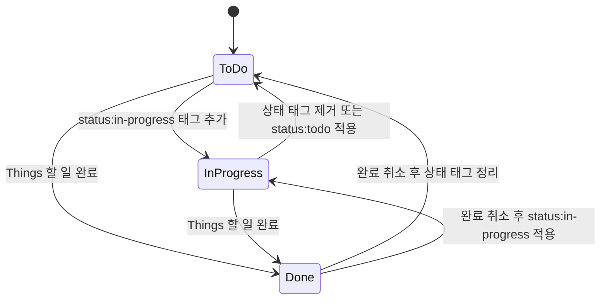

# Things Kanban App

## 목표

Things 3의 할 일을 칸반 보드로 시각화하고, 드래그 앤 드롭으로 작업 상태를 변경할 수 있는 macOS용 Tauri 데스크톱 앱을 만든다.

Things 3는 완료 여부는 제공하지만 진행 중 상태를 직접 표현하기 어렵다. 이 앱은 Things의 태그를 상태 저장 수단으로 사용해 `To Do`, `In Progress`, `Done` 흐름을 제공한다. Things를 원본 데이터(source of truth)로 유지하며, 사용자는 기존 Things 워크플로를 버리지 않고도 현재 작업량과 진행 상황을 한눈에 파악할 수 있어야 한다.

## 핵심 원칙

- Things 3가 할 일 데이터의 유일한 원본이다.
- 별도의 로컬 데이터베이스에 할 일을 복제하거나 독자적인 완료 상태를 만들지 않는다.
- 작업 상태는 Things 태그로 표현하고, 완료 상태는 Things의 실제 완료 여부를 우선한다.
- Things 데이터 쓰기는 공식적으로 안전한 AppleScript 또는 URL scheme을 통해서만 수행한다.
- Things SQLite 데이터베이스는 필요한 경우 읽기 전용 조회에만 사용한다.
- UI는 macOS 데스크톱 앱에 어울리도록 간결하고 빠르게 구성한다.
- 앱 오류가 Things의 기존 할 일, 프로젝트, Area, 태그를 손상시키지 않아야 한다.

## 상태 모델

기본 칸반 상태는 다음과 같다.

| 칸반 열 | Things 표현 | 설명 |
| --- | --- | --- |
| `To Do` | 상태 태그 없음 또는 `status:todo` 태그 | 아직 시작하지 않은 활성 할 일 |
| `In Progress` | `status:in-progress` 태그 | 현재 진행 중인 활성 할 일 |
| `Done` | Things의 완료 상태 | 완료된 할 일 |

상태 태그 이름은 추후 설정 화면에서 변경할 수 있도록 설계하되, MVP에서는 위 기본값을 사용한다.

`Done`은 태그로 중복 표현하지 않고 Things의 실제 완료 상태를 사용한다. 기본 화면에서는 `To Do`와 `In Progress`를 중심으로 표시하고, `Done` 열은 사용자가 표시 여부와 조회 기간을 선택할 수 있도록 한다.

상태 전이 규칙은 다음과 같다.



한 할 일에는 하나의 상태 태그만 유효해야 한다. 충돌하는 상태 태그가 발견되면 데이터를 임의로 덮어쓰기보다 UI에 충돌 상태를 표시하고, 사용자가 선택한 전이 시점에 정규화한다.

## 주요 사용자 경험

### 칸반 보드

- `To Do`, `In Progress`, 선택적 `Done` 열을 제공한다.
- 각 열의 할 일 수를 표시한다.
- 카드에는 제목, 프로젝트 또는 Area, 마감일, 예정일, 주요 태그를 간결하게 표시한다.
- 할 일을 카드 단위로 드래그 앤 드롭해 상태를 변경한다.
- 상태 변경 중에는 낙관적 UI를 제공하되, Things 반영에 실패하면 원래 열로 되돌리고 오류를 명확히 표시한다.
- 긴 목록에서도 쾌적하게 사용할 수 있도록 검색, 필터, 정렬을 지원한다.

### Things 연동

- 설치된 Things CLI를 우선 검토해 읽기 기능에 활용한다.
- CLI로 충족되지 않는 기능은 AppleScript로 구현한다.
- 쓰기 작업은 AppleScript 또는 Things URL scheme만 사용한다.
- Things SQLite 데이터베이스를 사용할 경우 읽기 전용으로만 접근한다.
- 앱 시작, 창 포커스 복귀, 수동 새로고침 시 Things의 최신 상태를 동기화한다.
- 외부에서 Things 데이터가 바뀌어도 새로고침 후 보드가 일관된 상태를 보여야 한다.

### Things에서 열기

- 각 카드에 `Things에서 열기` 액션을 제공한다.
- Things URL scheme을 사용해 해당 할 일을 Things 앱에서 바로 연다.
- 프로젝트 또는 Area 정보에도 가능한 경우 Things로 이동하는 액션을 제공한다.

### 범위와 필터

- 전체 활성 할 일뿐 아니라 Things 프로젝트, Area, 태그별로 보드를 좁힐 수 있다.
- Things의 PARA 구조를 유지하며 프로젝트와 Area 소속 정보를 그대로 보여준다.
- 앱에서 새 할 일을 추가하는 기능을 제공할 경우 반드시 기존 프로젝트 또는 Area를 선택하게 하여 Inbox에 방치하지 않는다.
- 완료 항목은 최근 기간을 기준으로 제한해 불필요한 대량 조회를 피한다.

## 기술 스택

`~/project/agentic-workspace`의 구조와 기술 선택을 기준으로 한다.

- 패키지 관리: pnpm 9
- 모노레포 및 작업 실행: pnpm workspace, Turbo
- 데스크톱 런타임: Tauri 2
- 백엔드: Rust
- 프런트엔드: React 19, Vite, TypeScript
- 서버 상태 및 비동기 작업: TanStack Query
- 스타일: Tailwind CSS 4
- UI 컴포넌트: shadcn/ui
- 드래그 앤 드롭: 접근성과 키보드 조작을 지원하는 React용 DnD 라이브러리
- 테스트: TypeScript 단위/컴포넌트 테스트, Rust 단위/통합 테스트, 핵심 사용자 흐름 E2E 테스트
- 컴포넌트 문서화: Storybook

드래그 앤 드롭 라이브러리는 구현 착수 시 유지보수 상태, React 19 호환성, 접근성, 다중 컨테이너 지원 여부를 검증한 뒤 결정한다.

## 프로젝트 구조

```text
things-kanban-app/
├── apps/
│   └── things-kanban/
│       ├── src/
│       │   ├── app/
│       │   ├── pages/
│       │   ├── features/
│       │   ├── entities/
│       │   └── shared/
│       ├── components/
│       │   └── ui/
│       └── src-tauri/
│           └── src/
│               ├── domain/
│               ├── application/
│               ├── inbound/
│               └── infrastructure/
├── packages/
│   └── ui/
├── docs/
├── package.json
├── pnpm-workspace.yaml
├── turbo.json
└── Cargo.toml
```

프런트엔드는 Feature-Sliced Design을 따른다.

- `app`: 앱 조합, 전역 프로바이더, 라우팅
- `pages`: 보드와 설정 등 화면 단위 UI
- `features`: 카드 이동, 필터, 검색, 새로고침, Things에서 열기
- `entities`: 할 일, 프로젝트, Area, 태그, 칸반 상태 모델과 API 어댑터
- `shared`: 공통 유틸리티와 shadcn/ui 외 재사용 컴포넌트
- `components/ui`: shadcn/ui 레지스트리 컴포넌트

Tauri 백엔드는 헥사고날 아키텍처를 따른다.

- `domain`: 순수 도메인 모델과 포트
- `application`: 조회, 상태 전이, 완료 및 완료 취소 유스케이스
- `inbound`: Tauri command 어댑터
- `infrastructure`: Things CLI, AppleScript, URL scheme, 읽기 전용 SQLite 어댑터

도메인 계층은 Tauri, AppleScript, CLI, SQLite 구현 세부사항에 의존하지 않는다.

## 도메인 모델

최소 도메인 모델은 다음 정보를 포함한다.

- `Todo`: Things 식별자, 제목, 완료 여부, 마감일, 예정일, 프로젝트/Area, 태그
- `Project`: Things 식별자, 이름, Area, 활성 여부
- `Area`: Things 식별자, 이름
- `Tag`: Things 식별자 또는 이름
- `KanbanStatus`: `todo`, `inProgress`, `done`
- `StatusMapping`: 칸반 상태와 Things 태그 또는 완료 상태의 대응 관계

Things 내부 식별자를 안정적으로 얻을 수 없는 연동 방식은 `Things에서 열기`와 업데이트 정확도에 영향을 줄 수 있으므로, 구현 초기에 CLI·AppleScript·읽기 전용 DB 각각의 식별자 호환성을 검증한다.

## 동기화 및 오류 처리

- 조회 결과를 정규화한 뒤 UI에 전달한다.
- 카드 이동 요청은 이전 상태, 목표 상태, 대상 Things 식별자를 포함한다.
- 쓰기 성공 후 Things에서 다시 읽어 실제 반영 여부를 확인한다.
- 쓰기 실패 또는 검증 실패 시 UI 상태를 롤백하고 재시도 방법을 제공한다.
- Things가 실행 중이지 않거나 접근 권한이 없을 때 원인을 구분해 안내한다.
- macOS 자동화 권한 요청의 목적과 설정 방법을 앱에서 설명한다.
- 로그에는 할 일 본문이나 민감한 메모를 기본적으로 남기지 않는다.

## MVP 범위

1. Things의 활성 할 일을 읽어 `To Do`와 `In Progress` 열에 표시한다.
2. `status:in-progress` 태그를 기준으로 두 활성 상태를 구분한다.
3. 카드 드래그 앤 드롭으로 두 상태 사이를 이동하고 Things에 반영한다.
4. 카드를 Things에서 바로 연다.
5. 프로젝트, Area, 태그 필터와 제목 검색을 제공한다.
6. 수동 새로고침과 앱 포커스 복귀 시 동기화한다.
7. 최근 완료 항목을 선택적으로 `Done` 열에 표시한다.
8. 로딩, 빈 상태, 권한 오류, Things 연동 실패를 명확히 표현한다.

## MVP 제외 범위

- Things를 대체하는 독립적인 할 일 관리 시스템
- Things Cloud와의 직접 통신 또는 비공식 네트워크 API
- Things SQLite 데이터베이스 직접 쓰기
- iOS 및 Windows 지원
- 다중 사용자 협업
- 사용자 정의 워크플로 열의 무제한 생성
- Things가 지원하지 않는 카드 순서의 영구 저장

## 완료 기준

- Things의 활성 할 일이 올바른 열, 프로젝트/Area, 태그 정보와 함께 표시된다.
- `To Do`와 `In Progress` 사이의 드래그 앤 드롭이 Things 태그에 정확히 반영된다.
- `Done`으로 이동하면 Things에서 완료 처리되고, 완료 취소 시 활성 상태로 정상 복구된다.
- 앱과 Things에서 동시에 변경한 뒤 새로고침해도 상태가 일관된다.
- 각 카드에서 해당 할 일을 Things로 열 수 있다.
- Things 데이터베이스에 직접 쓰지 않는다.
- 키보드만으로도 카드 상태를 변경할 수 있고, 상태 변화가 보조 기술에 전달된다.
- 오류 발생 시 데이터 손실 없이 롤백되며 사용자가 원인을 이해할 수 있다.
- TypeScript 타입 검사, 프런트엔드 테스트, Rust 테스트, Tauri 빌드가 통과한다.
- 핵심 도메인과 상태 전이 로직이 인프라 구현과 분리되어 테스트 가능하다.

## 단계별 구현 방향

### 1단계: 연동 가능성 검증

- 설치된 Things CLI의 조회 및 업데이트 기능 확인
- AppleScript에서 필요한 할 일, 프로젝트, Area, 태그와 식별자 접근 확인
- Things URL scheme을 통한 개별 할 일 열기 확인
- 읽기 전용 SQLite 조회가 필요한 범위와 스키마 의존 위험 확인

### 2단계: 읽기 전용 보드

- 프로젝트 골격 구성
- Things 조회 포트와 인프라 어댑터 구현
- TanStack Query 기반 데이터 조회
- shadcn/ui 기반 칸반 보드와 카드 구현
- 필터, 검색, 빈 상태 및 오류 화면 구현

### 3단계: 상태 전이

- 상태 전이 유스케이스 구현
- 드래그 앤 드롭 및 키보드 이동 구현
- 태그 변경, 완료, 완료 취소 연동
- 낙관적 업데이트, 검증, 롤백 구현

### 4단계: 완성도와 안정성

- Things에서 열기와 macOS 권한 안내
- 자동 새로고침과 외부 변경 대응
- Storybook 및 테스트 보강
- 성능, 접근성, 오류 복구 검증
- macOS 앱 번들 및 배포 설정

## 향후 확장

- 상태 태그 이름 및 보드 표시 설정
- 프로젝트별 보드 즐겨찾기
- WIP 제한과 진행 중 작업 강조
- 마감 임박 및 지연 작업 시각화
- 빠른 할 일 생성과 프로젝트/Area 지정
- 카드 상세 편집
- 보드 필터 프리셋
- 상태 변경 이력 또는 간단한 작업 분석

