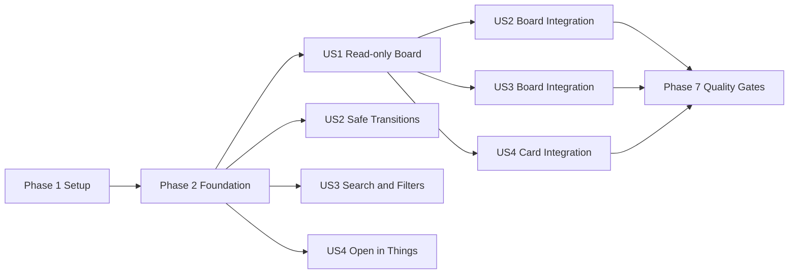

# Tasks: Things 칸반 프로젝트 초기 구성

**Input**: Design documents from `/specs/001-initialize-project/`
**Prerequisites**: plan.md, spec.md, research.md, data-model.md, contracts/, quickstart.md

**Tests**: 프로젝트 헌법에 따라 도메인 규칙, Things 어댑터, 핵심 사용자 흐름 테스트가 필수다. 각 스토리의 테스트 작업을 구현보다 먼저 수행하고 실패를 확인한다.

**Organization**: 각 사용자 스토리를 독립적으로 구현·검증할 수 있도록 단계별로 구성한다.

## Format: `[ID] [P?] [Story] Description`

- **[P]**: 선행 작업 완료 후 다른 파일에서 병렬 실행 가능
- **[Story]**: 명세의 사용자 스토리 매핑
- 모든 작업은 구현 또는 검증 대상의 정확한 파일 경로를 포함한다.

## Phase 1: Setup

**Purpose**: pnpm/Turbo와 Tauri 데스크톱 앱의 실행 가능한 초기 구조를 만든다.

- [x] T001 Create pnpm workspace root manifests and shared scripts in package.json, pnpm-workspace.yaml, and turbo.json
- [x] T002 Scaffold the React 19 Vite application manifest and entry points in apps/things-kanban/package.json, apps/things-kanban/index.html, and apps/things-kanban/src/main.tsx
- [x] T003 Scaffold the Tauri 2 Rust application and workspace membership in Cargo.toml, apps/things-kanban/src-tauri/Cargo.toml, apps/things-kanban/src-tauri/tauri.conf.json, and apps/things-kanban/src-tauri/src/main.rs
- [x] T004 [P] Configure TypeScript project references and path aliases in tsconfig.json, apps/things-kanban/tsconfig.json, and apps/things-kanban/vite.config.ts
- [x] T005 [P] Configure Tailwind CSS 4 and global macOS-oriented design tokens in apps/things-kanban/src/app/styles/globals.css and apps/things-kanban/components.json
- [x] T006 [P] Configure Vitest, React Testing Library, and shared test setup in apps/things-kanban/vitest.config.ts and apps/things-kanban/src/shared/test/setup.ts
- [x] T007 [P] Configure Storybook and interaction testing in apps/things-kanban/.storybook/main.ts and apps/things-kanban/.storybook/preview.tsx
- [x] T008 [P] Configure Playwright Tauri E2E scaffolding and safe test environment guards in apps/things-kanban/playwright.config.ts and apps/things-kanban/tests/e2e/environment.ts

**Checkpoint**: 앱 셸을 빌드하고 프런트엔드 및 Rust 테스트 러너를 빈 상태로 실행할 수 있다.

---

## Phase 2: Foundational

**Purpose**: 모든 사용자 스토리가 공유하는 도메인, 포트, 오류, 프런트엔드 호출 기반을 만든다.

**⚠️ CRITICAL**: 이 단계가 완료되기 전에는 사용자 스토리 구현을 시작하지 않는다.

- [x] T009 Define ThingsId, Todo, ProjectRef, AreaRef, TagRef, KanbanStatus, and status resolution rules in apps/things-kanban/src-tauri/src/domain/model/mod.rs and apps/things-kanban/src-tauri/src/domain/model/todo.rs
- [x] T010 [P] Define BoardQuery, BoardSnapshot, StatusTransitionRequest, StatusTransitionResult, and IntegrationError in apps/things-kanban/src-tauri/src/domain/model/board.rs and apps/things-kanban/src-tauri/src/domain/error.rs
- [x] T011 [P] Define the read/write-classified ThingsRepository port from the contract in apps/things-kanban/src-tauri/src/domain/ports/things_repository.rs
- [x] T012 [P] Add privacy-safe structured logging that excludes todo titles, notes, and tag values in apps/things-kanban/src-tauri/src/infrastructure/logging.rs
- [x] T013 Implement AppleScript process execution, JSON decoding, timeout handling, and normalized error mapping in apps/things-kanban/src-tauri/src/infrastructure/things/applescript/runner.rs and apps/things-kanban/src-tauri/src/infrastructure/things/applescript/error.rs
- [x] T014 Implement Things installation and automation permission diagnostics in apps/things-kanban/src-tauri/src/infrastructure/things/applescript/diagnostics.rs and apps/things-kanban/src-tauri/src/application/queries/get_integration_status.rs
- [x] T015 Register application services, Things adapters, and typed Tauri command handlers without business logic in apps/things-kanban/src-tauri/src/lib.rs and apps/things-kanban/src-tauri/src/inbound/tauri/mod.rs
- [x] T016 [P] Define frontend command DTOs, invoke wrappers, and normalized error types in apps/things-kanban/src/shared/api/contracts.ts and apps/things-kanban/src/shared/api/tauri.ts
- [x] T017 Configure TanStack Query, application error boundary, and root providers in apps/things-kanban/src/app/providers/query-provider.tsx, apps/things-kanban/src/app/providers/error-boundary.tsx, and apps/things-kanban/src/app/app.tsx
- [x] T018 [P] Add deterministic Todo and BoardSnapshot fixtures plus an in-memory ThingsRepository fake in apps/things-kanban/src-tauri/src/domain/fixtures.rs and apps/things-kanban/src/shared/test/board-fixtures.ts

**Checkpoint**: 사용자 실제 Things 데이터 없이 도메인, command 및 UI 테스트를 작성할 공통 기반이 준비된다.

---

## Phase 3: User Story 1 — Things 할 일을 보드에서 파악하기 (Priority: P1) 🎯 MVP

**Goal**: Things의 활성 할 일과 선택한 최근 완료 항목을 정확한 열과 맥락 정보로 표시하고 새로고침 시 원본 상태에 수렴한다.

**Independent Test**: 상태 태그, 프로젝트/Area, 일정, 최근 완료 항목을 포함한 대역 데이터를 조회해 정확한 열·카드·개수가 표시되는지 확인하고, 실제 AppleScript 계약 테스트에서 공개 ID와 필드 매핑을 검증한다.

### Tests for User Story 1

- [x] T019 [P] [US1] Add failing unit tests for completion-first status mapping, status-tag conflicts, canceled exclusion, and 30-day completion filtering in apps/things-kanban/src-tauri/src/domain/model/todo_test.rs and apps/things-kanban/src-tauri/src/domain/model/board_test.rs
- [x] T020 [P] [US1] Add failing AppleScript decoder contract tests for text IDs, tags, dates, project/Area relationships, and missing optional fields in apps/things-kanban/src-tauri/src/infrastructure/things/applescript/read_contract_test.rs
- [x] T021 [P] [US1] Add failing get_board command tests for loading success, normalized errors, and sensitive-field exclusion in apps/things-kanban/src-tauri/src/inbound/tauri/get_board_test.rs
- [x] T022 [P] [US1] Add failing board component tests for To Do, In Progress, optional Done, counts, loading, empty, and permission states in apps/things-kanban/src/pages/board/board-page.test.tsx
- [x] T023 [P] [US1] Add failing refresh integration tests for manual refresh and window-focus invalidation in apps/things-kanban/src/features/refresh-board/refresh-board.test.tsx

### Implementation for User Story 1

- [x] T024 [US1] Implement AppleScript read templates and normalized DTO conversion for active and recent completed todos in apps/things-kanban/src-tauri/src/infrastructure/things/applescript/read.rs and apps/things-kanban/src-tauri/src/infrastructure/things/applescript/mapper.rs
- [x] T025 [US1] Implement fetch_board and fetch_todo on the AppleScript ThingsRepository adapter in apps/things-kanban/src-tauri/src/infrastructure/things/applescript/repository.rs
- [x] T026 [US1] Implement board normalization and completion-window query use case in apps/things-kanban/src-tauri/src/application/queries/get_board.rs
- [x] T027 [US1] Expose get_board and get_integration_status according to the command contract in apps/things-kanban/src-tauri/src/inbound/tauri/get_board.rs and apps/things-kanban/src-tauri/src/inbound/tauri/get_integration_status.rs
- [x] T028 [P] [US1] Implement frontend Todo and Board entities, status selectors, and query keys in apps/things-kanban/src/entities/todo/model.ts and apps/things-kanban/src/entities/board/model.ts
- [x] T029 [P] [US1] Create accessible board card, column, skeleton, empty, and integration-error views in apps/things-kanban/src/entities/todo/ui/todo-card.tsx and apps/things-kanban/src/entities/board/ui/
- [x] T030 [US1] Implement board query hook, Done visibility control, board composition, and per-column counts in apps/things-kanban/src/entities/board/api/use-board-query.ts and apps/things-kanban/src/pages/board/board-page.tsx
- [x] T031 [US1] Implement manual refresh and focus-return invalidation with visible refresh state in apps/things-kanban/src/features/refresh-board/ui/refresh-button.tsx and apps/things-kanban/src/features/refresh-board/model/use-focus-refresh.ts
- [x] T032 [US1] Add Storybook stories for populated, loading, empty, permission-denied, unavailable, conflict, and optional Done states in apps/things-kanban/src/pages/board/board-page.stories.tsx

**Checkpoint**: P1 읽기 전용 보드는 독립 실행·시연 가능하고 Things를 변경하지 않는다.

---

## Phase 4: User Story 2 — 카드 상태를 안전하게 변경하기 (Priority: P2)

**Goal**: 포인터와 키보드로 상태를 변경하고, Things 재조회 검증 후 확정하거나 실패 시 데이터 손실 없이 롤백한다.

**Independent Test**: 대역과 전용 테스트 할 일에서 모든 허용 전이를 실행해 관련 없는 태그와 PARA 소속이 보존되는지, 실패·검증 불일치 시 이전 UI 상태가 복원되는지 확인한다.

### Tests for User Story 2

- [x] T033 [P] [US2] Add failing transition-table unit tests for all active/done transitions, conflict normalization, and invalid requests in apps/things-kanban/src-tauri/src/application/use_cases/transition_todo_test.rs
- [x] T034 [P] [US2] Add failing adapter contract tests for ID-targeted tag preservation, completion, undo completion, permission denial, and verification mismatch in apps/things-kanban/src-tauri/src/infrastructure/things/applescript/write_contract_test.rs
- [x] T035 [P] [US2] Add failing transition_todo command tests for serialized same-item requests and verified result DTOs in apps/things-kanban/src-tauri/src/inbound/tauri/transition_todo_test.rs
- [x] T036 [P] [US2] Add failing optimistic mutation tests for immediate movement, rollback, retry, and authoritative refresh in apps/things-kanban/src/features/move-todo/model/use-transition-todo.test.tsx
- [x] T037 [P] [US2] Add failing keyboard, pointer, move-menu, focus, and live-announcement component tests in apps/things-kanban/src/features/move-todo/ui/kanban-dnd.test.tsx

### Implementation for User Story 2

- [x] T038 [US2] Implement transition validation, state-tag normalization, completion/undo, post-write verification, and result mapping in apps/things-kanban/src-tauri/src/application/use_cases/transition_todo.rs
- [x] T039 [US2] Implement preservation-safe AppleScript status-tag and completion writes on the repository adapter in apps/things-kanban/src-tauri/src/infrastructure/things/applescript/write.rs and apps/things-kanban/src-tauri/src/infrastructure/things/applescript/repository.rs
- [x] T040 [US2] Expose serialized transition_todo command handling with privacy-safe request logging in apps/things-kanban/src-tauri/src/inbound/tauri/transition_todo.rs
- [x] T041 [US2] Implement TanStack Query optimistic snapshots, rollback, retry, per-item pending state, and authoritative result replacement in apps/things-kanban/src/features/move-todo/model/use-transition-todo.ts
- [x] T042 [US2] Integrate the verified stable dnd-kit React 19 packages with pointer and keyboard sensors across columns in apps/things-kanban/src/features/move-todo/ui/kanban-dnd.tsx and apps/things-kanban/package.json
- [x] T043 [US2] Add a keyboard-accessible explicit move menu and localized screen-reader instructions/live announcements in apps/things-kanban/src/features/move-todo/ui/move-todo-menu.tsx and apps/things-kanban/src/features/move-todo/ui/status-announcer.tsx
- [x] T044 [US2] Wire DnD and move-menu transitions into board cards with non-color pending, success, conflict, and failure feedback in apps/things-kanban/src/pages/board/board-page.tsx and apps/things-kanban/src/entities/todo/ui/todo-card.tsx

**Checkpoint**: P1과 무관하게 대역 보드에서 P2 전이를 검증할 수 있고, 실제 통합에서는 Things가 권위 상태를 결정한다.

---

## Phase 5: User Story 3 — 필요한 할 일만 찾아 집중하기 (Priority: P3)

**Goal**: 프로젝트, Area, 태그, 제목 검색과 정렬을 조합해 필요한 카드와 정확한 열별 개수만 표시한다.

**Independent Test**: 여러 소속과 제목을 가진 고정 스냅샷에서 각 단일·조합 조건, 정렬, 결과 없음과 조건 초기화를 검증한다.

### Tests for User Story 3

- [x] T045 [P] [US3] Add failing pure selector tests for combined project, Area, tag, normalized title search, sorting, and derived counts in apps/things-kanban/src/entities/board/model/select-board.test.ts
- [x] T046 [P] [US3] Add failing filter toolbar interaction tests for composition, clear-all, keyboard access, and no-results recovery in apps/things-kanban/src/features/filter-board/ui/board-filters.test.tsx
- [x] T047 [P] [US3] Add failing 1,000-card responsiveness benchmark guard for search and filtering in apps/things-kanban/src/entities/board/model/select-board.bench.test.ts

### Implementation for User Story 3

- [x] T048 [US3] Implement memoized board filtering, title normalization, sorting, and count selectors in apps/things-kanban/src/entities/board/model/select-board.ts
- [x] T049 [P] [US3] Implement accessible project, Area, tag, search, sort, Done-period, and clear controls in apps/things-kanban/src/features/filter-board/ui/board-filters.tsx
- [x] T050 [US3] Implement BoardQuery UI state and connect filtered results and counts to the board page in apps/things-kanban/src/features/filter-board/model/use-board-filters.ts and apps/things-kanban/src/pages/board/board-page.tsx
- [x] T051 [US3] Add no-results guidance and filter-state Storybook scenarios in apps/things-kanban/src/features/filter-board/ui/filter-empty-state.tsx and apps/things-kanban/src/features/filter-board/ui/board-filters.stories.tsx

**Checkpoint**: P3는 고정 BoardSnapshot만으로 독립 검증 가능하며 원본 Things 데이터는 변경하지 않는다.

---

## Phase 6: User Story 4 — Things에서 원본 확인하기 (Priority: P4)

**Goal**: 정확한 Things ID가 있는 할 일·프로젝트·Area를 Things에서 열고, 지원 불가 상태는 오해 없이 안내한다.

**Independent Test**: 항목 종류별 정확한 ID 열기와 잘못된 ID·지원되지 않는 종류의 안전한 실패를 대역 및 전용 테스트 항목에서 확인한다.

### Tests for User Story 4

- [x] T052 [P] [US4] Add failing show_item adapter and open_in_things command tests for todo, project, Area, missing ID, and unsupported kind in apps/things-kanban/src-tauri/src/infrastructure/things/applescript/show_contract_test.rs and apps/things-kanban/src-tauri/src/inbound/tauri/open_in_things_test.rs
- [x] T053 [P] [US4] Add failing card and parent-link interaction tests for success, disabled, and error feedback in apps/things-kanban/src/features/open-in-things/open-in-things.test.tsx

### Implementation for User Story 4

- [x] T054 [US4] Implement exact-ID AppleScript show_item and open_in_things command mapping without name fallback in apps/things-kanban/src-tauri/src/infrastructure/things/applescript/show.rs and apps/things-kanban/src-tauri/src/inbound/tauri/open_in_things.rs
- [x] T055 [US4] Implement frontend open command hook and accessible todo/project/Area actions in apps/things-kanban/src/features/open-in-things/use-open-in-things.ts and apps/things-kanban/src/features/open-in-things/open-in-things-button.tsx
- [x] T056 [US4] Integrate original-item actions and unsupported-state explanations into cards and board context in apps/things-kanban/src/entities/todo/ui/todo-card.tsx and apps/things-kanban/src/pages/board/board-page.tsx

**Checkpoint**: P4는 이름 추측 없이 정확한 원본만 열며 데이터 쓰기를 수행하지 않는다.

---

## Phase 7: Polish & Cross-Cutting Quality

**Purpose**: 전체 스토리의 안전성, 접근성, 성능과 릴리스 게이트를 검증한다.

- [x] T057 [P] Add full board E2E coverage with a fake repository for loading, refresh, filtering, all transitions, rollback, and open actions in apps/things-kanban/tests/e2e/board.spec.ts
- [x] T058 [P] Add opt-in real Things AppleScript smoke tests guarded to a dedicated test project and todo IDs in apps/things-kanban/src-tauri/tests/things_smoke.rs
- [x] T059 [P] Add automated accessibility checks and keyboard-only board journey coverage in apps/things-kanban/tests/e2e/accessibility.spec.ts
- [x] T060 Audit logs and error payloads for title, notes, tag values, tokens, and raw AppleScript leakage in apps/things-kanban/src-tauri/tests/privacy.rs
- [x] T061 Verify every Things mutation uses only public AppleScript or official URL actions and add a no-SQLite-write architecture guard in apps/things-kanban/src-tauri/tests/integration_boundaries.rs
- [x] T062 Run the 1,000-card performance scenario and document measured startup, filter, and transition timings in specs/001-initialize-project/quickstart.md
- [x] T063 Run pnpm check-types, pnpm test, pnpm storybook:test, cargo test --workspace, pnpm tauri:build, pnpm test:e2e, and git diff --check; record passing results in specs/001-initialize-project/quickstart.md

---

## Dependencies & Execution Order

### Phase Dependencies

- **Phase 1 Setup**: 즉시 시작 가능하다.
- **Phase 2 Foundational**: Phase 1 완료 후 진행하며 모든 사용자 스토리를 차단한다.
- **Phase 3 US1**: Phase 2 완료 후 시작 가능하며 읽기 전용 MVP를 제공한다.
- **Phase 4 US2**: Phase 2 완료 후 대역으로 독립 개발 가능하지만 실제 보드 통합 T044는 US1의 T029-T030이 필요하다.
- **Phase 5 US3**: Phase 2 완료 후 고정 스냅샷으로 독립 개발 가능하지만 페이지 통합 T050은 US1의 T030이 필요하다.
- **Phase 6 US4**: Phase 2 완료 후 독립 개발 가능하지만 카드 통합 T056은 US1의 T029-T030이 필요하다.
- **Phase 7 Polish**: 릴리스하려는 모든 사용자 스토리가 완료된 후 진행한다.

### User Story Completion Order



### Within Each User Story

- 테스트 작업을 먼저 작성하고 예상 이유로 실패하는지 확인한다.
- 순수 모델과 어댑터를 command 및 UI 통합보다 먼저 구현한다.
- 사용자 스토리의 Independent Test를 통과한 뒤 체크포인트를 완료한다.
- 실제 Things 쓰기 테스트는 전용 테스트 항목과 명시적 옵트인 없이는 실행하지 않는다.

## Parallel Opportunities

- Phase 1에서 T004-T008은 T001-T003의 해당 골격이 생긴 뒤 서로 다른 설정 파일에서 병렬 실행 가능하다.
- Phase 2에서 T010-T012, T016, T018은 T009의 공통 명명만 확정되면 병렬 실행 가능하다.
- US1 테스트 T019-T023과 UI 모델 T028-T029는 각 선행 계약 완료 후 병렬화할 수 있다.
- US2 테스트 T033-T037은 서로 다른 계층에서 병렬 실행 가능하고, T042-T043도 mutation hook T041의 인터페이스 확정 후 병렬화할 수 있다.
- US3 테스트 T045-T047과 US4 테스트 T052-T053은 각 스토리 내부에서 병렬 실행 가능하다.
- Phase 2 완료 후 US2의 백엔드, US3의 순수 필터, US4의 열기 command는 US1 UI와 병렬 개발할 수 있다.

## Parallel Execution Examples

### User Story 1

```text
T019: domain status and completion-window tests
T020: AppleScript read decoder contract tests
T022: board component state tests
T023: refresh integration tests
```

### User Story 2

```text
T033: transition-table unit tests
T034: AppleScript mutation contract tests
T036: optimistic mutation tests
T037: keyboard and pointer interaction tests
```

### User Story 3

```text
T045: pure selector correctness tests
T046: filter toolbar interaction tests
T047: 1,000-card benchmark guard
```

### User Story 4

```text
T052: backend exact-ID show contract tests
T053: frontend original-item action tests
```

## Implementation Strategy

### MVP First

1. Phase 1 Setup을 완료한다.
2. Phase 2 Foundational을 완료한다.
3. Phase 3 US1 읽기 전용 보드를 완료한다.
4. US1 Independent Test와 Things 읽기 계약을 검증한다.
5. 실제 데이터를 쓰지 않는 읽기 전용 MVP를 시연한다.

### Incremental Delivery

1. **US1**: Things를 변경하지 않는 시각화, 완료 표시, 새로고침.
2. **US2**: 검증·롤백·접근성을 갖춘 상태 전이.
3. **US3**: 큰 목록에서 검색, 필터, 정렬.
4. **US4**: 정확한 원본 항목으로 이동.
5. **Polish**: 실제 연동 옵트인 검증, 접근성, 성능, 개인정보, 전체 빌드 게이트.

### Recommended First Implementation Slice

T001-T018로 기반을 만든 뒤 T019-T032만 구현한다. 이 범위는 Things 데이터에 쓰지 않으면서 핵심 가치와 AppleScript 식별자·조회 가능성을 검증하는 안전한 MVP다.

## Notes

- `[P]`는 동일 선행 조건 이후 서로 다른 파일에서 수행 가능한 작업이다.
- `[USn]`은 명세 사용자 스토리와 추적 가능하게 연결된다.
- 작업 완료 시 해당 테스트와 관련 품질 검사를 실행한다.
- 문서 다이어그램은 Mermaid만 사용한다.
- 실제 Things 데이터에 대한 직접 SQLite 쓰기는 어떤 작업에도 포함되지 않는다.
