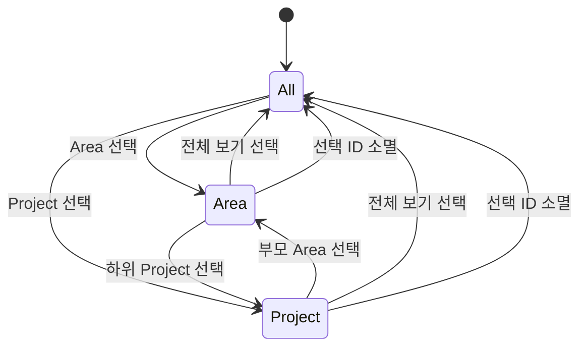

# Data Model: 3열 보드와 Area/Project 사이드바

## Things 기반 엔터티

### Todo

| 필드               | 형식                            | 규칙                               |
| ------------------ | ------------------------------- | ---------------------------------- |
| `id`               | `ThingsId`                      | 비어 있지 않은 Things 공개 ID      |
| `title`            | 문자열                          | 카드 제목, 기본 로그 제외          |
| `completionStatus` | `open`, `completed`, `canceled` | 실제 Things 상태                   |
| `completionDate`   | 날짜 또는 없음                  | 최근 30일 완료 판정                |
| `project`          | `ProjectRef` 또는 없음          | 직접 Project 소속                  |
| `area`             | `AreaRef` 또는 없음             | 직접 Area 또는 Project의 Area 문맥 |
| `tags`             | `TagRef[]`                      | 상태 및 사용자 태그                |
| `status`           | `todo`, `inProgress`, `done`    | Things 데이터에서 파생             |

**Validation**:

- `completed`는 상태 태그보다 우선하며 `done`으로 파생한다.
- `canceled`는 세 열에서 제외한다.
- 완료일이 있는 완료 항목은 `completionDate >= now - 30 days`일 때 포함한다.
- 완료 상태지만 완료일이 없으면 데이터 손실을 피하기 위해 이번 스냅샷의 Done에 포함하고 진단에는 내용 없이 오류 종류만 기록한다.

### AreaRef

| 필드     | 형식       | 규칙                    |
| -------- | ---------- | ----------------------- |
| `id`     | `ThingsId` | 선택과 관계 매핑의 기준 |
| `name`   | 문자열     | 사이드바·카드 표시      |
| `active` | 불리언     | 비활성 Area 제외 기준   |

### ProjectRef

| 필드     | 형식                | 규칙                           |
| -------- | ------------------- | ------------------------------ |
| `id`     | `ThingsId`          | 선택과 필터의 기준             |
| `name`   | 문자열              | 사이드바·카드 표시             |
| `area`   | `AreaRef` 또는 없음 | 부모 Area, 없으면 독립 Project |
| `active` | 불리언              | 완료·취소 Project 제외 기준    |

## 파생 표시 모델

### KanbanStatus

- `todo`: 열린 상태이며 `status:in-progress` 없음
- `inProgress`: 열린 상태이며 `status:in-progress` 존재
- `done`: Things 실제 상태가 완료

### CompletionWindow

| 필드    | 값                    |
| ------- | --------------------- |
| `days`  | `30`                  |
| `since` | 현재 시각에서 30일 전 |
| `label` | `최근 30일`           |

### BoardScope

```text
all
area(id)
project(id)
```

이 값은 프런트엔드 세션의 표시 상태이며 영구 저장하지 않는다.

**Scope rules**:

- `all`: 스냅샷의 모든 카드
- `project(id)`: `todo.project.id == id`
- `area(id)`: `todo.area.id == id` 또는 `todo.project.area.id == id`

### SidebarNode

| 필드           | 형식                     | 설명                        |
| -------------- | ------------------------ | --------------------------- |
| `kind`         | `all`, `area`, `project` | 탐색 항목 종류              |
| `id`           | 문자열                   | `all` 고정값 또는 Things ID |
| `name`         | 문자열                   | 접근 가능한 표시 이름       |
| `parentAreaId` | Things ID 또는 없음      | Project 계층 관계           |
| `children`     | `SidebarNode[]`          | Area 아래 Project           |

**Ordering**:

1. 전체 보기
2. Area 이름순, 각 Area 안의 Project 이름순
3. 독립 Project 이름순

중복 이름은 ID가 다르면 별도 노드다.

### BoardView

| 필드               | 형식         | 설명               |
| ------------------ | ------------ | ------------------ |
| `scope`            | `BoardScope` | 사이드바 현재 선택 |
| `search`           | 문자열       | 제목 검색          |
| `tagNames`         | 문자열 배열  | 보완 태그 필터     |
| `sort`             | 정렬 기준    | 카드 정렬          |
| `sidebarCollapsed` | 불리언       | 레이아웃 표시 상태 |

### BoardSnapshot

| 필드               | 형식               | 설명                   |
| ------------------ | ------------------ | ---------------------- |
| `todos`            | `Todo[]`           | 활성 및 최근 완료 카드 |
| `projects`         | `ProjectRef[]`     | 활성 Project 전체      |
| `areas`            | `AreaRef[]`        | 활성 Area 전체         |
| `tags`             | `TagRef[]`         | 필터 옵션              |
| `completionWindow` | `CompletionWindow` | Done 조회 기준         |
| `refreshedAt`      | 날짜               | 권위 스냅샷 생성 시각  |

## 상태 변화

### Sidebar selection



사이드바 전이는 Things 쓰기를 발생시키지 않는다.

### Todo transition

기존 전이 규칙을 유지한다. 활성 상태에서 `done`으로 이동하면 실제 완료, `done`에서 활성 상태로 이동하면 완료 취소 후 목표 상태 태그를 정규화한다. 쓰기 후 동일 ID를 재조회해 목표 상태가 확인될 때만 성공한다.
