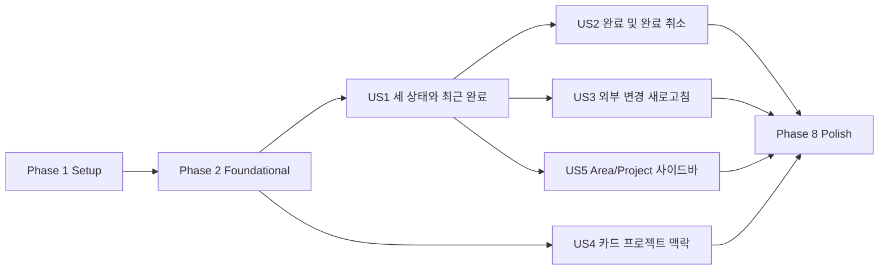

# Tasks: 완료된 할 일 및 프로젝트별 칸반 탐색

**Input**: Design documents from `/specs/002-show-completed-todos/`
**Prerequisites**: `plan.md`, `spec.md`, `research.md`, `data-model.md`, `contracts/`, `quickstart.md`

**Tests**: 프로젝트 constitution에 따라 도메인 로직, Things 경계, UI 상호작용에는 구현보다 먼저 자동화 테스트를 추가한다.

**Organization**: 각 사용자 스토리는 독립적으로 구현하고 검증할 수 있도록 테스트와 구현 작업을 함께 묶었다.

## Phase 1: Setup (공통 준비)

**Purpose**: 새 완료 상태, 프로젝트/영역 계층, 탐색 UI를 테스트할 공통 기반을 준비한다.

- [X] T001 완료일, 직접 Area 할 일, 프로젝트 할 일, 미지정 프로젝트를 포함하도록 프런트엔드 보드 fixture를 확장한다: `apps/things-kanban/src/shared/test/board-fixtures.ts`
- [X] T002 [P] 완료일과 활성 Area/Project 계층을 재사용할 Rust 테스트 fixture 모듈을 추가한다: `apps/things-kanban/src-tauri/src/domain/fixtures.rs`
- [X] T003 [P] 보드 범위 선택 기능의 FSD public API 파일을 생성한다: `apps/things-kanban/src/features/select-board-scope/index.ts`
- [X] T004 [P] 세 상태와 사이드바 시나리오를 지원하도록 Storybook 공통 보드 fixture를 갱신한다: `apps/things-kanban/src/shared/test/storybook-board-fixtures.ts`

---

## Phase 2: Foundational (차단 선행 작업)

**Purpose**: 모든 사용자 스토리가 공유하는 데이터 계약, 도메인 모델, 조회 파이프라인을 확정한다.

**⚠️ CRITICAL**: 이 단계가 끝나기 전에는 사용자 스토리 구현을 시작하지 않는다.

- [X] T005 `AreaRef`/`ProjectRef`의 활성 상태와 부모 관계, `CompletionWindow`, 완전한 `BoardSnapshot` 모델을 정의한다: `apps/things-kanban/src-tauri/src/domain/model/board.rs`
- [X] T006 [P] Things 완료일과 실제 완료 상태를 표현하도록 Todo 도메인 모델을 확장한다: `apps/things-kanban/src-tauri/src/domain/model/todo.rs`
- [X] T007 Rust fixture 모듈을 도메인 모듈에서 노출한다: `apps/things-kanban/src-tauri/src/domain/mod.rs`
- [X] T008 [P] `showDone`, `projectIds`, `areaIds` 요청 필드를 제거하고 활성 컬렉션과 완료 기간 응답을 추가한다: `apps/things-kanban/src/shared/api/contracts.ts`
- [X] T009 [P] `BoardScope`, `SidebarNode`, 접힘 상태의 순수 프런트엔드 타입을 정의한다: `apps/things-kanban/src/entities/board/model/board-scope.ts`
- [X] T010 범위 필터 뒤 검색·태그·정렬을 적용하도록 보드 selector 파이프라인의 인터페이스를 확장한다: `apps/things-kanban/src/entities/board/model/select-board.ts`
- [X] T011 항상 최근 30일 완료 항목을 요청하는 안정적인 query key와 `get_board` 호출 계약으로 갱신한다: `apps/things-kanban/src/entities/board/api/use-board-query.ts`

**Checkpoint**: 공통 계약이 고정되어 각 사용자 스토리를 독립적으로 진행할 수 있다.

---

## Phase 3: User Story 1 - Todo, In Progress, Done을 항상 확인 (Priority: P1) 🎯 MVP

**Goal**: 완료 항목이 없더라도 세 칼럼을 항상 표시하고, 최근 30일 내 완료된 Things 항목을 Done에 표시한다.

**Independent Test**: fixture에서 Todo/In Progress/최근 Done 항목을 제공했을 때 세 칼럼과 정확한 카드가 보이고, Done이 비어도 Done 칼럼이 유지되는지 확인한다.

### Tests for User Story 1

- [X] T012 [P] [US1] 실제 완료 상태와 30일 경계의 포함·제외 규칙을 검증하는 도메인 단위 테스트를 추가한다: `apps/things-kanban/src-tauri/src/domain/model/board.rs`
- [X] T013 [P] [US1] AppleScript가 완료일 ISO 8601 및 빈 항목을 직렬화하는 계약 테스트를 추가한다: `apps/things-kanban/src-tauri/src/infrastructure/things/applescript/repository.rs`
- [X] T014 [P] [US1] `get_board`가 완료 항목과 완료 기간 메타데이터를 항상 반환하는 command 테스트를 추가한다: `apps/things-kanban/src-tauri/src/application/query/get_board.rs`
- [X] T015 [P] [US1] Done이 비어 있는 경우를 포함해 세 칼럼이 항상 렌더링되는 컴포넌트 테스트를 추가한다: `apps/things-kanban/src/pages/board/board-page.test.tsx`

### Implementation for User Story 1

- [X] T016 [US1] Things 완료일을 ISO 8601로 읽고 파싱하며 최근 완료 항목을 포함하도록 AppleScript repository를 구현한다: `apps/things-kanban/src-tauri/src/infrastructure/things/applescript/repository.rs`
- [X] T017 [US1] 실제 완료 상태를 우선하고 최근 30일 완료 기간을 적용하도록 보드 조회를 구현한다: `apps/things-kanban/src-tauri/src/application/query/get_board.rs`
- [X] T018 [P] [US1] `showDone` 필터 상태와 토글 UI를 제거한다: `apps/things-kanban/src/features/filter-board/model/use-board-filters.ts`
- [X] T019 [US1] 비어 있어도 Todo/In Progress/Done 칼럼을 항상 생성하도록 보드 페이지를 갱신한다: `apps/things-kanban/src/pages/board/board-page.tsx`
- [X] T020 [P] [US1] 빈 Done과 최근 완료 카드가 있는 세 칼럼 Storybook 시나리오를 추가한다: `apps/things-kanban/src/pages/board/board-page.stories.tsx`

**Checkpoint**: 세 상태와 최근 완료 항목만으로 독립 배포 가능한 MVP가 완성된다.

---

## Phase 4: User Story 2 - 완료 및 완료 취소 (Priority: P2)

**Goal**: 카드 이동과 키보드 동작으로 완료/완료 취소하고 Things의 실제 상태와 태그를 보존한다.

**Independent Test**: Todo 또는 In Progress 카드를 Done으로 옮기면 완료되고, Done 카드를 되돌리면 완료 취소되며 새로고침 후에도 상태와 기존 태그가 유지되는지 확인한다.

### Tests for User Story 2

- [X] T021 [P] [US2] 완료·완료 취소 전이가 실제 완료 상태와 기존 태그를 보존하는 도메인 테스트를 추가한다: `apps/things-kanban/src-tauri/src/domain/service/status_transition.rs`
- [X] T022 [P] [US2] 완료·완료 취소 AppleScript 쓰기가 허용된 명령만 사용하는 계약 테스트를 추가한다: `apps/things-kanban/src-tauri/src/infrastructure/things/applescript/repository.rs`
- [X] T023 [P] [US2] 세 칼럼 간 낙관적 이동, 실패 롤백, query 무효화를 검증하는 mutation 테스트를 추가한다: `apps/things-kanban/src/features/move-todo/model/use-move-todo.test.tsx`
- [X] T024 [P] [US2] 키보드로 Done 이동 및 완료 취소가 가능한지 검증하는 보드 상호작용 테스트를 추가한다: `apps/things-kanban/src/pages/board/board-page.test.tsx`

### Implementation for User Story 2

- [X] T025 [US2] Done 전이와 Done 이탈을 Things 완료/완료 취소 명령으로 매핑한다: `apps/things-kanban/src-tauri/src/domain/service/status_transition.rs`
- [X] T026 [US2] 태그를 덮어쓰지 않는 완료·완료 취소 AppleScript repository 동작을 구현한다: `apps/things-kanban/src-tauri/src/infrastructure/things/applescript/repository.rs`
- [X] T027 [US2] 완료 항목이 포함된 전체 보드 snapshot에서 낙관적 이동과 롤백을 수행하도록 mutation을 갱신한다: `apps/things-kanban/src/features/move-todo/model/use-move-todo.ts`
- [X] T028 [US2] 포인터와 키보드 이동이 세 칼럼 상태 전이를 동일하게 호출하도록 보드 DnD 연결을 갱신한다: `apps/things-kanban/src/pages/board/board-page.tsx`

**Checkpoint**: 앱 안에서 완료 상태를 양방향으로 안전하게 변경할 수 있다.

---

## Phase 5: User Story 3 - 외부 변경 새로고침 (Priority: P3)

**Goal**: Things에서 외부로 완료/완료 취소한 결과를 수동 또는 포커스 새로고침으로 정확히 반영한다.

**Independent Test**: 첫 snapshot 이후 Things 상태를 바꾼 두 번째 snapshot을 반환하면 카드가 해당 칼럼으로 이동하고 중복이나 유실이 없는지 확인한다.

### Tests for User Story 3

- [X] T029 [P] [US3] 외부 완료·완료 취소 snapshot 교체 시 카드 중복 없이 실제 상태를 반영하는 query 테스트를 추가한다: `apps/things-kanban/src/entities/board/api/use-board-query.test.tsx`
- [X] T030 [P] [US3] 포커스 복귀와 수동 새로고침이 완료 항목을 포함한 전체 snapshot을 다시 읽는 컴포넌트 테스트를 추가한다: `apps/things-kanban/src/pages/board/board-page.test.tsx`

### Implementation for User Story 3

- [X] T031 [US3] 포커스 복귀 시 완료 항목을 포함한 보드 query를 재검증하도록 query 정책을 갱신한다: `apps/things-kanban/src/entities/board/api/use-board-query.ts`
- [X] T032 [US3] 수동 새로고침 상태와 오류 피드백을 전체 snapshot 갱신에 연결한다: `apps/things-kanban/src/features/refresh-board/ui/refresh-board-button.tsx`
- [X] T033 [US3] 외부 상태가 낙관적 캐시보다 우선하도록 이동 mutation 정산 로직을 갱신한다: `apps/things-kanban/src/features/move-todo/model/use-move-todo.ts`

**Checkpoint**: Things를 source of truth로 유지하면서 외부 변경을 복구할 수 있다.

---

## Phase 6: User Story 4 - 카드의 프로젝트 맥락 식별 (Priority: P4)

**Goal**: 같은 제목의 할 일도 Project와 Area 맥락으로 구별하고 직접 Area/미지정 항목을 명확히 표시한다.

**Independent Test**: 같은 제목을 가진 서로 다른 Project 카드, Area 직접 카드, 미지정 카드가 각각 다른 맥락 레이블과 안정적인 식별자를 표시하는지 확인한다.

### Tests for User Story 4

- [X] T034 [P] [US4] Project+Area, Area 직접, 미지정, 같은 제목의 맥락 레이블 selector 테스트를 추가한다: `apps/things-kanban/src/entities/todo/model/select-todo-context.test.ts`
- [X] T035 [P] [US4] 카드가 프로젝트명과 상위 Area를 접근 가능한 텍스트로 표시하는 컴포넌트 테스트를 추가한다: `apps/things-kanban/src/entities/todo/ui/todo-card.test.tsx`

### Implementation for User Story 4

- [X] T036 [US4] 이름이 아닌 Things ID와 부모 관계로 카드 맥락을 도출하는 selector를 구현한다: `apps/things-kanban/src/entities/todo/model/select-todo-context.ts`
- [X] T037 [US4] 프로젝트명, Area명, 직접 Area/미지정 상태를 카드 메타데이터에 표시한다: `apps/things-kanban/src/entities/todo/ui/todo-card.tsx`
- [X] T038 [P] [US4] 중복 제목과 각 맥락 유형을 시각적으로 검증하는 카드 Storybook 사례를 추가한다: `apps/things-kanban/src/entities/todo/ui/todo-card.stories.tsx`

**Checkpoint**: 보드 범위를 바꾸지 않아도 각 카드의 소속을 구분할 수 있다.

---

## Phase 7: User Story 5 - Project와 Area 사이드바 탐색 (Priority: P5)

**Goal**: 사이드바에서 All, Area, Project를 계층적으로 선택하고 메인 영역에 해당 범위의 세 칼럼 칸반만 표시한다.

**Independent Test**: All, 빈 Area, 자식 Project가 있는 Area, 독립 Project를 각각 선택했을 때 올바른 항목만 세 칼럼에 남고 제목·선택·접힘 상태·키보드 탐색이 정확한지 확인한다.

### Tests for User Story 5

- [X] T039 [P] [US5] 빈 Area, 자식 Project, 독립 Project, 중복 이름을 ID 기반 트리로 구성하는 selector 테스트를 추가한다: `apps/things-kanban/src/entities/board/model/select-sidebar-tree.test.ts`
- [X] T040 [P] [US5] All/Area 직접+자식 Project/정확한 Project/오래된 선택 ID 범위 규칙 테스트를 추가한다: `apps/things-kanban/src/entities/board/model/select-board.test.ts`
- [X] T041 [P] [US5] 선택, 확장/축소, 포커스 이동, ARIA tree semantics를 검증하는 사이드바 테스트를 추가한다: `apps/things-kanban/src/features/select-board-scope/ui/board-sidebar.test.tsx`
- [X] T042 [P] [US5] 작은 화면 접힘과 선택 범위 제목을 검증하는 보드 레이아웃 테스트를 추가한다: `apps/things-kanban/src/pages/board/board-page.test.tsx`
- [X] T043 [P] [US5] Area와 Project 선택별 세 칼럼 필터링을 검증하는 E2E 테스트를 추가한다: `apps/things-kanban/e2e/board-scope.spec.ts`

### Implementation for User Story 5

- [X] T044 [US5] 활성 Area와 Project를 할 일 유무와 무관하게 별도 수집하고 부모 관계를 반환하도록 AppleScript 조회를 확장한다: `apps/things-kanban/src-tauri/src/infrastructure/things/applescript/repository.rs`
- [X] T045 [US5] ID 기반 Area/Project 계층과 독립 Project 그룹을 생성하는 selector를 구현한다: `apps/things-kanban/src/entities/board/model/select-sidebar-tree.ts`
- [X] T046 [US5] All, Area, Project 범위를 순수 함수로 적용하고 오래된 ID를 All로 정규화한다: `apps/things-kanban/src/entities/board/model/select-board.ts`
- [X] T047 [P] [US5] 세션 내 선택 및 Area 접힘 상태를 관리하는 scope hook을 구현한다: `apps/things-kanban/src/features/select-board-scope/model/use-board-scope.ts`
- [X] T048 [US5] All/Areas/Projects 계층, 선택 강조, 키보드 탐색을 갖춘 사이드바를 구현한다: `apps/things-kanban/src/features/select-board-scope/ui/board-sidebar.tsx`
- [X] T049 [US5] 선택 범위 제목과 필터된 세 칼럼 보드를 데스크톱 사이드바 레이아웃에 통합한다: `apps/things-kanban/src/pages/board/board-page.tsx`
- [X] T050 [US5] 작은 화면 사이드바 토글, 너비, 스크롤, 선택 강조 스타일을 구현한다: `apps/things-kanban/src/app/styles.css`
- [X] T051 [US5] 새로고침 후 사라진 Area/Project 선택을 All로 되돌리고 상태 변경을 알린다: `apps/things-kanban/src/features/select-board-scope/model/use-board-scope.ts`
- [X] T052 [P] [US5] All, Area 선택, Project 선택, 접힌 사이드바 Storybook 사례를 추가한다: `apps/things-kanban/src/pages/board/board-page.stories.tsx`

**Checkpoint**: 프로젝트와 Area별로 구별 가능한 전체 탐색 경험이 독립적으로 완성된다.

---

## Phase 8: Polish & Cross-Cutting Concerns

**Purpose**: 전체 스토리에 걸친 성능, 접근성, 보안 경계, 문서를 검증한다.

- [X] T053 [P] 1,000개 활성 항목과 200개 완료 항목에서 selector 및 렌더 성능 회귀 테스트를 추가한다: `apps/things-kanban/src/entities/board/model/select-board.performance.test.ts`
- [X] T054 [P] 사이드바부터 카드 이동까지 키보드 전용 핵심 흐름 E2E 테스트를 추가한다: `apps/things-kanban/e2e/keyboard-board.spec.ts`
- [X] T055 [P] SQLite 직접 쓰기와 민감 데이터 로그가 없음을 검증하는 Things 경계 회귀 테스트를 갱신한다: `apps/things-kanban/src-tauri/tests/things_boundary.rs`
- [X] T056 사용자 시나리오와 수동 검증 절차를 실제 명령 및 화면 동작에 맞게 갱신한다: `specs/002-show-completed-todos/quickstart.md`
- [X] T057 `quickstart.md`의 Rust, 프런트엔드, E2E, lint 및 format 검증 명령을 모두 실행하고 실패를 수정한다: `specs/002-show-completed-todos/quickstart.md`

---

## Dependencies & Execution Order

### Phase Dependencies

- **Setup (Phase 1)**: 즉시 시작 가능
- **Foundational (Phase 2)**: Setup 완료 후 시작하며 모든 사용자 스토리를 차단
- **User Story 1 (Phase 3)**: Foundational 완료 후 시작; MVP
- **User Story 2 (Phase 4)**: Foundational 및 US1의 세 칼럼/완료 조회 계약에 의존
- **User Story 3 (Phase 5)**: US1의 전체 snapshot 조회에 의존하며 US2와 병렬 진행 가능
- **User Story 4 (Phase 6)**: Foundational 완료 후 독립 진행 가능
- **User Story 5 (Phase 7)**: Foundational의 범위 모델과 US1의 세 칼럼 보드에 의존; US2~US4와 병렬 진행 가능
- **Polish (Phase 8)**: 필요한 사용자 스토리 완료 후 진행



### Within Each User Story

- 테스트를 먼저 작성하고 실패를 확인한다.
- 도메인/selector 모델을 repository 및 UI보다 먼저 구현한다.
- Things repository 변경 뒤 application query와 프런트엔드 연결을 구현한다.
- 핵심 구현 뒤 Storybook/E2E 시나리오를 추가한다.
- 각 Checkpoint에서 해당 스토리의 Independent Test를 단독 실행한다.

### Parallel Opportunities

- T002, T003, T004는 T001과 병렬 실행 가능
- T006, T008, T009는 T005의 세부 구현과 병렬 실행 가능
- 각 스토리의 `[P]` 테스트는 서로 다른 파일에서 병렬 작성 가능
- Foundational 완료 후 US4는 US1 구현과 병렬 진행 가능
- US1 완료 후 US2, US3, US5는 파일 충돌을 조정하며 병렬 진행 가능
- T053, T054, T055는 서로 병렬 실행 가능

---

## Parallel Example: User Story 5

```text
Task T039: "사이드바 트리 selector 테스트 - select-sidebar-tree.test.ts"
Task T040: "보드 범위 selector 테스트 - select-board.test.ts"
Task T041: "사이드바 접근성 테스트 - board-sidebar.test.tsx"
Task T042: "반응형 레이아웃 테스트 - board-page.test.tsx"
Task T043: "범위 선택 E2E 테스트 - board-scope.spec.ts"
```

테스트가 실패하는 것을 확인한 뒤 다음 구현 묶음을 병렬화할 수 있다.

```text
Task T044: "Things Area/Project 컬렉션 조회 - repository.rs"
Task T047: "범위 상태 hook - use-board-scope.ts"
Task T052: "사이드바 Storybook 시나리오 - board-page.stories.tsx"
```

---

## Implementation Strategy

### MVP First (User Story 1 Only)

1. Phase 1 Setup 완료
2. Phase 2 Foundational 완료
3. Phase 3 User Story 1 완료
4. 세 칼럼 고정, 최근 완료 기간 경계, 빈 Done을 독립 검증
5. 필요하면 이 시점에 MVP 배포

### Incremental Delivery

1. Setup + Foundational → 공통 데이터 계약 확정
2. US1 → 세 상태와 최근 완료 항목 제공
3. US2 → 완료/완료 취소 쓰기 제공
4. US3 → Things 외부 변경 동기화 강화
5. US4 → 카드별 Project/Area 식별성 제공
6. US5 → Project/Area 사이드바 필터링 제공
7. Polish → 성능, 접근성, 경계, 전체 검증

### Team Parallel Strategy

1. 공통 Setup과 Foundational은 함께 완료한다.
2. 이후 작업자는 충돌이 적은 경계로 분리한다.
   - Backend: T012~~T017, T021~~T026, T044
   - Board state/query: T029~~T033, T039~~T047
   - UI/accessibility: T015, T019~~T020, T034~~T038, T041~~T043, T048~~T052
3. 각 스토리는 테스트 실패 → 구현 → 독립 검증 순서를 유지한다.

---

## Notes

- `[P]`는 의존성이 해소된 뒤 서로 다른 파일에서 병렬 수행 가능한 작업이다.
- `[USn]`은 해당 작업을 독립 사용자 스토리와 추적 가능하게 연결한다.
- Things 쓰기는 AppleScript 명령만 사용하고 SQLite는 읽기 전용 경계에서도 제품 코드에 도입하지 않는다.
- 이름이 같은 Area/Project는 표시명이 아니라 안정적인 Things ID로 구분한다.
- 선택, 접힘 상태는 세션 전용이며 Things 데이터에는 기록하지 않는다.
- 각 사용자 스토리 Checkpoint에서 커밋하면 회귀 범위를 작게 유지할 수 있다.
