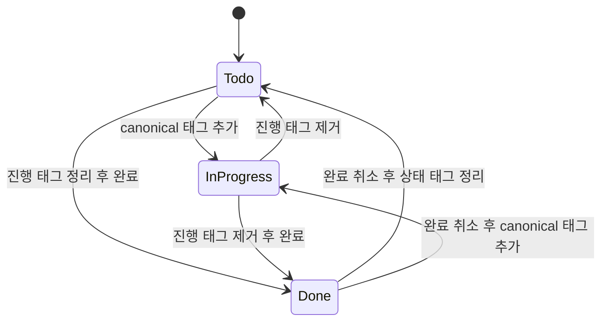
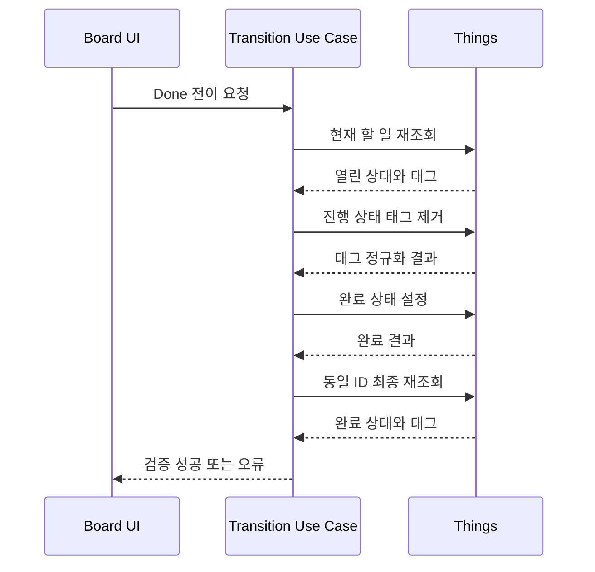

# Data Model: 상태 전이 태그 정규화

## Todo

| 필드               | 형식                            | 규칙                                |
| ------------------ | ------------------------------- | ----------------------------------- |
| `id`               | Things 공개 ID                  | 모든 쓰기와 재조회에서 동일 ID 사용 |
| `completionStatus` | `open`, `completed`, `canceled` | Done 판정의 유일한 권위             |
| `tags`             | 태그 목록                       | 관련 없는 태그는 보존               |
| `status`           | `todo`, `inProgress`, `done`    | 완료 상태와 진행 태그에서 파생      |
| `project`, `area`  | 선택적 소속                     | 상태 전이로 변경하지 않음           |

## StatusTag

| 구분                  | 값                   | 읽기                      | 쓰기                       |
| --------------------- | -------------------- | ------------------------- | -------------------------- |
| canonical In Progress | `in progress`        | In Progress로 판정        | 새 In Progress 전이에 사용 |
| legacy In Progress    | `status:in-progress` | In Progress로 판정        | 명시적 전이 시 제거        |
| legacy Todo           | `status:todo`        | Todo와 충돌 감지에 사용   | 명시적 전이 시 제거        |
| user tag              | 그 외 모든 태그      | 상태 판정에 사용하지 않음 | 그대로 보존                |

## StatusTransition

| 필드                 | 설명                                             |
| -------------------- | ------------------------------------------------ |
| `todoId`             | 대상 Things 할 일 ID                             |
| `previousStatus`     | 요청 시 UI가 알고 있던 상태                      |
| `targetStatus`       | 사용자가 선택한 단일 목표 상태                   |
| `requestId`          | 중복 요청 추적용 식별자                          |
| `verifiedTodo`       | 최종 Things 재조회 결과                          |
| `normalizedConflict` | 명시적 전이로 상태 태그 충돌이 해소되었는지 여부 |

## Validation Rules

- 완료된 할 일은 어떤 상태 태그가 있더라도 Done으로 판정한다.
- 열린 할 일에 canonical 또는 legacy 진행 태그가 하나 이상 있으면 In Progress로 판정한다.
- In Progress 전이 후 canonical 태그는 정확히 하나이며 legacy 진행/Todo 상태 태그는 없다.
- Todo 전이 후 canonical/legacy 진행 및 legacy Todo 상태 태그는 없다.
- Done 전이 후 실제 완료 상태이며 canonical/legacy 진행 상태 태그가 없다.
- canceled 항목, 삭제된 항목 또는 요청의 이전 상태와 실제 상태가 다른 항목은 전이를 성공으로 처리하지 않는다.
- 상태 태그 외 태그, 제목, 날짜, 메모, Project 및 Area는 변경하지 않는다.

## State Transitions

## Done Transition Sequence

