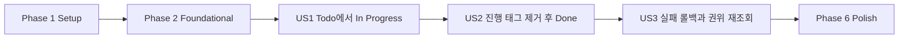

# Tasks: 상태 전이 태그 정규화

**Input**: Design documents from `/specs/003-normalize-status-tags/`
**Prerequisites**: `plan.md`, `spec.md`, `research.md`, `data-model.md`, `contracts/transition-todo.md`, `quickstart.md`

**Tests**: Constitution에 따라 상태 매핑과 전이, Things 어댑터, 낙관적 롤백 및 키보드 사용자 경로의 자동화 테스트를 구현보다 먼저 작성한다.

**Organization**: 각 사용자 스토리는 독립적으로 구현하고 검증할 수 있도록 테스트와 구현 작업을 함께 묶었다.

## Phase 1: Setup (공통 준비)

**Purpose**: canonical/legacy 태그와 단계별 실패를 재현할 공통 테스트 기반을 준비한다.

- [X] T001 canonical, legacy, 사용자 태그 조합을 생성하는 Rust Todo fixture를 확장한다: `apps/things-kanban/src-tauri/src/domain/fixtures.rs`
- [X] T002 [P] Todo, In Progress, Done 전이별 프런트엔드 board fixture를 확장한다: `apps/things-kanban/src/shared/test/board-fixtures.ts`
- [X] T003 [P] 호출 순서와 단계별 오류를 기록하는 ThingsRepository 테스트 대역 모듈을 추가한다: `apps/things-kanban/src-tauri/src/application/use_cases/test_repository.rs`

---

## Phase 2: Foundational (차단 선행 작업)

**Purpose**: 모든 사용자 스토리가 공유하는 상태 태그 분류와 검증 인터페이스를 정의한다.

**⚠️ CRITICAL**: 이 단계가 끝나기 전에는 사용자 스토리 구현을 시작하지 않는다.

- [X] T004 canonical `in progress`, legacy `status:in-progress`, legacy `status:todo` 상수와 분류 함수를 정의한다: `apps/things-kanban/src-tauri/src/domain/model/todo.rs`
- [X] T005 [P] 상태 태그 존재 여부와 canonical 정규화 완료 여부를 검사하는 Todo 도메인 메서드를 정의한다: `apps/things-kanban/src-tauri/src/domain/model/todo.rs`
- [X] T006 상태 태그 치환 포트의 보존·멱등성·재조회 계약을 문서화하고 필요한 반환 타입을 확정한다: `apps/things-kanban/src-tauri/src/domain/ports/things_repository.rs`
- [X] T007 [P] 테스트 repository 모듈을 use case 모듈에서 테스트 전용으로 노출한다: `apps/things-kanban/src-tauri/src/application/use_cases/mod.rs`

**Checkpoint**: canonical/legacy 판정과 repository 테스트 대역을 모든 사용자 스토리에서 사용할 수 있다.

---

## Phase 3: User Story 1 - 할 일을 진행 중으로 전환 (Priority: P1) 🎯 MVP

**Goal**: Todo를 In Progress로 옮기면 열린 상태를 유지하고 canonical `in progress` 태그를 정확히 하나 추가하며 다른 태그를 보존한다.

**Independent Test**: 사용자 태그가 있는 열린 Todo를 In Progress로 전환한 뒤 canonical 태그가 하나 존재하고 legacy 상태 태그는 없으며 사용자 태그와 PARA 정보가 유지되는지 확인한다.

### Tests for User Story 1

- [X] T008 [P] [US1] canonical과 legacy 진행 태그를 모두 In Progress로 판정하고 완료 상태가 우선하는 도메인 테스트를 추가한다: `apps/things-kanban/src-tauri/src/domain/model/todo.rs`
- [X] T009 [P] [US1] In Progress 태그 치환이 상태 태그만 제거하고 사용자 태그를 보존하는 AppleScript 계약 테스트를 추가한다: `apps/things-kanban/src-tauri/src/infrastructure/things/applescript/repository.rs`
- [X] T010 [P] [US1] Todo→In Progress 호출 순서, canonical 태그 한 개, 사용자 태그 보존을 검증하는 use case 테스트를 추가한다: `apps/things-kanban/src-tauri/src/application/use_cases/transition_todo.rs`
- [X] T011 [P] [US1] 상태 선택 메뉴가 Todo→In Progress command를 동일한 요청 형식으로 호출하는 컴포넌트 테스트를 추가한다: `apps/things-kanban/src/features/move-todo/ui/move-todo-menu.test.tsx`

### Implementation for User Story 1

- [X] T012 [US1] 열린 Todo 상태 판정이 canonical과 legacy 진행 태그를 모두 인식하도록 구현한다: `apps/things-kanban/src-tauri/src/domain/model/todo.rs`
- [X] T013 [US1] 상태 태그를 제거한 뒤 In Progress 목표에는 canonical 태그 하나만 추가하도록 AppleScript adapter를 구현한다: `apps/things-kanban/src-tauri/src/infrastructure/things/applescript/repository.rs`
- [X] T014 [US1] Todo→In Progress 전이에서 태그 정규화 결과와 최종 열린 상태를 검증하도록 use case를 구현한다: `apps/things-kanban/src-tauri/src/application/use_cases/transition_todo.rs`
- [X] T015 [P] [US1] 카드 표시에서 canonical과 legacy 상태 태그를 사용자 태그 배지에서 모두 제외한다: `apps/things-kanban/src/entities/todo/ui/todo-card.tsx`

**Checkpoint**: Todo→In Progress 전이를 독립적으로 배포 가능한 MVP로 검증할 수 있다.

---

## Phase 4: User Story 2 - 진행 중 할 일을 완료 (Priority: P2)

**Goal**: Done 전이 시 canonical/legacy 진행 태그를 먼저 제거하고 Things의 실제 완료 상태로 변경한 뒤 최종 상태를 검증한다.

**Independent Test**: canonical 또는 legacy 진행 태그와 사용자 태그가 있는 열린 할 일을 Done으로 전환한 뒤 호출 순서가 태그 제거→완료→최종 재조회이고, 완료 상태이며 진행 태그가 없고 사용자 태그와 PARA 정보가 보존되는지 확인한다.

### Tests for User Story 2

- [X] T016 [P] [US2] In Progress→Done과 Todo→Done의 태그 제거·완료·최종 재조회 순서를 검증하는 use case 테스트를 추가한다: `apps/things-kanban/src-tauri/src/application/use_cases/transition_todo.rs`
- [X] T017 [P] [US2] 진행 태그가 없을 때도 Done 태그 정리가 멱등적이며 사용자 태그를 유지하는 adapter 테스트를 추가한다: `apps/things-kanban/src-tauri/src/infrastructure/things/applescript/repository.rs`
- [X] T018 [P] [US2] Done 성공 응답이 실제 완료 상태와 진행 태그 부재를 모두 요구하는 command 계약 테스트를 추가한다: `apps/things-kanban/src-tauri/src/inbound/tauri/mod.rs`
- [X] T019 [P] [US2] 키보드 상태 선택으로 In Progress 카드를 Done으로 이동하는 E2E 시나리오를 추가한다: `apps/things-kanban/tests/e2e/board.spec.ts`

### Implementation for User Story 2

- [X] T020 [US2] Done 전이에서 먼저 상태 태그를 Todo 목표로 정규화하고 결과를 검증한 뒤 완료 쓰기를 호출한다: `apps/things-kanban/src-tauri/src/application/use_cases/transition_todo.rs`
- [X] T021 [US2] 완료 쓰기 뒤 동일 ID를 최종 재조회해 completed 상태와 진행 태그 부재를 함께 검증한다: `apps/things-kanban/src-tauri/src/application/use_cases/transition_todo.rs`
- [X] T022 [US2] canonical/legacy 진행 태그만 제거하고 다른 태그의 이름과 순서를 보존하는 AppleScript 태그 쓰기를 완성한다: `apps/things-kanban/src-tauri/src/infrastructure/things/applescript/repository.rs`
- [X] T023 [P] [US2] transition command가 강화된 최종 검증 오류를 기존 오류 계약으로 전달하는지 확인한다: `apps/things-kanban/src-tauri/src/inbound/tauri/mod.rs`

**Checkpoint**: 진행 상태 태그가 남지 않는 실제 Done 전이를 독립적으로 검증할 수 있다.

---

## Phase 5: User Story 3 - 실패 시 기존 상태 보존 (Priority: P3)

**Goal**: 태그 제거·추가·완료·최종 검증 중 어느 단계가 실패해도 성공으로 표시하지 않고 UI를 이전 snapshot과 Things 권위 상태로 복구한다.

**Independent Test**: 각 쓰기 단계와 최종 재조회를 하나씩 실패시켰을 때 command가 오류를 반환하고 낙관적으로 이동한 카드가 이전 상태로 복구되며 board query 재검증 후 Things 실제 상태가 표시되는지 확인한다.

### Tests for User Story 3

- [X] T024 [P] [US3] 이전 상태 불일치, 태그 쓰기 실패, 완료 실패, 최종 태그 잔존을 검증하는 use case 오류 테스트를 추가한다: `apps/things-kanban/src-tauri/src/application/use_cases/transition_todo.rs`
- [X] T025 [P] [US3] 자동화 권한 거부와 항목 삭제 오류가 민감한 Todo 내용을 포함하지 않는 adapter 계약 테스트를 추가한다: `apps/things-kanban/src-tauri/src/infrastructure/things/applescript/repository.rs`
- [X] T026 [P] [US3] mutation 실패 시 모든 board cache snapshot을 복구하고 query를 무효화하는 테스트를 추가한다: `apps/things-kanban/src/features/move-todo/model/use-transition-todo.test.tsx`
- [X] T027 [P] [US3] 전이 실패 안내가 라이브 영역에 표시되고 새로고침 후 권위 상태로 수렴하는 보드 테스트를 추가한다: `apps/things-kanban/src/pages/board/board-page.test.tsx`

### Implementation for User Story 3

- [X] T028 [US3] 단계별 repository 오류와 최종 상태 불일치를 `verification_failed` 또는 원본 안전 오류로 반환한다: `apps/things-kanban/src-tauri/src/application/use_cases/transition_todo.rs`
- [X] T029 [US3] 낙관적 snapshot 롤백 후 board query 재검증이 항상 실행되도록 mutation 정산 로직을 보강한다: `apps/things-kanban/src/features/move-todo/model/use-transition-todo.ts`
- [X] T030 [US3] 권한·쓰기·검증 실패를 재시도 가능한 비색상 상태 메시지로 연결한다: `apps/things-kanban/src/pages/board/board-page.tsx`

**Checkpoint**: 모든 사용자 스토리와 부분 실패 복구가 독립적으로 검증된다.

---

## Phase 6: Polish & Cross-Cutting Concerns

**Purpose**: 전체 전이 행렬, 보안 경계, 문서 및 릴리스 품질을 검증한다.

- [X] T031 [P] Done→Todo 및 Done→In Progress 회귀와 canonical 태그 정규화 테스트를 추가한다: `apps/things-kanban/src-tauri/src/application/use_cases/transition_todo.rs`
- [X] T032 [P] SQLite 쓰기 금지와 민감한 제목·메모·태그 로그 금지 회귀 테스트를 갱신한다: `apps/things-kanban/src-tauri/tests/integration_boundaries.rs`
- [X] T033 [P] canonical/legacy/충돌/부분 실패 수동 검증 절차를 실제 동작에 맞게 갱신한다: `specs/003-normalize-status-tags/quickstart.md`
- [X] T034 포맷, 타입 검사, Rust/프런트엔드 테스트, Storybook, E2E, 웹/Tauri 빌드 및 diff 검사를 모두 실행하고 실패를 수정한다: `specs/003-normalize-status-tags/quickstart.md`

---

## Dependencies & Execution Order

### Phase Dependencies

- **Setup (Phase 1)**: 즉시 시작 가능
- **Foundational (Phase 2)**: Setup 완료 후 시작하며 모든 사용자 스토리를 차단
- **User Story 1 (Phase 3)**: Foundational 완료 후 시작; 권장 MVP
- **User Story 2 (Phase 4)**: Foundational과 US1의 canonical/legacy 판정에 의존
- **User Story 3 (Phase 5)**: US1과 US2의 쓰기 단계가 존재해야 모든 실패 지점을 검증 가능
- **Polish (Phase 6)**: 원하는 사용자 스토리 완료 후 진행



### Within Each User Story

- 테스트를 먼저 작성하고 실패를 확인한다.
- 도메인 판정과 테스트 대역을 adapter 및 use case보다 먼저 구현한다.
- AppleScript adapter 쓰기 뒤 application use case의 순서와 최종 검증을 구현한다.
- 핵심 구현 뒤 UI mutation, 접근성 및 E2E를 연결한다.
- 각 Checkpoint에서 해당 스토리의 Independent Test를 단독 실행한다.

### Parallel Opportunities

- T002와 T003은 T001과 병렬 실행 가능
- T005와 T007은 T004의 인터페이스 결정 후 서로 병렬 실행 가능
- 각 사용자 스토리의 `[P]` 테스트는 서로 다른 파일에서 병렬 작성 가능
- T015는 T012~T014와 파일 충돌 없이 병렬 진행 가능
- T019와 T023은 T020~T022 구현 후 서로 병렬 검증 가능
- T025, T026, T027은 T024와 서로 다른 경계에서 병렬 작성 가능
- T031, T032, T033은 서로 병렬 실행 가능

---

## Parallel Examples

### User Story 1

```text
Task T008: "도메인 태그 판정 테스트 - todo.rs"
Task T009: "AppleScript 태그 보존 계약 테스트 - repository.rs"
Task T010: "Todo→In Progress use case 테스트 - transition_todo.rs"
Task T011: "키보드 상태 선택 컴포넌트 테스트 - move-todo-menu.test.tsx"
```

### User Story 2

```text
Task T016: "Done 쓰기 순서 use case 테스트 - transition_todo.rs"
Task T017: "멱등 태그 제거 adapter 테스트 - repository.rs"
Task T018: "Done command 계약 테스트 - inbound/tauri/mod.rs"
Task T019: "키보드 Done 전이 E2E - board.spec.ts"
```

### User Story 3

```text
Task T024: "단계별 실패 use case 테스트 - transition_todo.rs"
Task T025: "권한·삭제 adapter 오류 테스트 - repository.rs"
Task T026: "낙관적 롤백 mutation 테스트 - use-transition-todo.test.tsx"
Task T027: "실패 알림과 권위 수렴 보드 테스트 - board-page.test.tsx"
```

---

## Implementation Strategy

### MVP First (User Story 1 Only)

1. Phase 1 Setup 완료
2. Phase 2 Foundational 완료
3. Phase 3 User Story 1 완료
4. Todo→In Progress의 canonical 태그 한 개와 사용자 태그 보존을 독립 검증
5. 필요하면 이 시점에 MVP 배포

### Incremental Delivery

1. Setup + Foundational → 상태 태그 분류와 테스트 기반 확정
2. US1 → canonical In Progress 쓰기 제공
3. US2 → 진행 태그 없는 실제 Done 전이 제공
4. US3 → 단계별 오류, UI 롤백 및 권위 상태 수렴 제공
5. Polish → 전체 전이 행렬과 릴리스 게이트 검증

### Team Parallel Strategy

1. 공통 Setup과 Foundational은 함께 완료한다.
2. 이후 충돌을 줄이도록 경계를 분리한다.
   - Domain/use case: `todo.rs`, `transition_todo.rs`
   - Things adapter: `repository.rs`
   - Frontend recovery/accessibility: `use-transition-todo.ts`, `board-page.tsx`, E2E
3. 같은 Rust 파일에 걸친 스토리는 우선순위 순서로 통합하고, 서로 다른 경계의 `[P]` 작업은 병렬 진행한다.

---

## Notes

- `[P]`는 의존성이 해소된 뒤 서로 다른 파일에서 병렬 수행 가능한 작업이다.
- `[USn]`은 작업을 독립 사용자 스토리와 추적 가능하게 연결한다.
- canonical 태그는 `in progress`, legacy 호환 태그는 `status:in-progress`다.
- Done 전이 성공은 실제 완료 상태와 진행 태그 부재를 모두 만족해야 한다.
- 상태 태그 외 태그와 모든 PARA 메타데이터는 보존한다.
- 실제 Things 쓰기 테스트는 전용 테스트 할 일과 명시적 옵트인에서만 실행한다.
