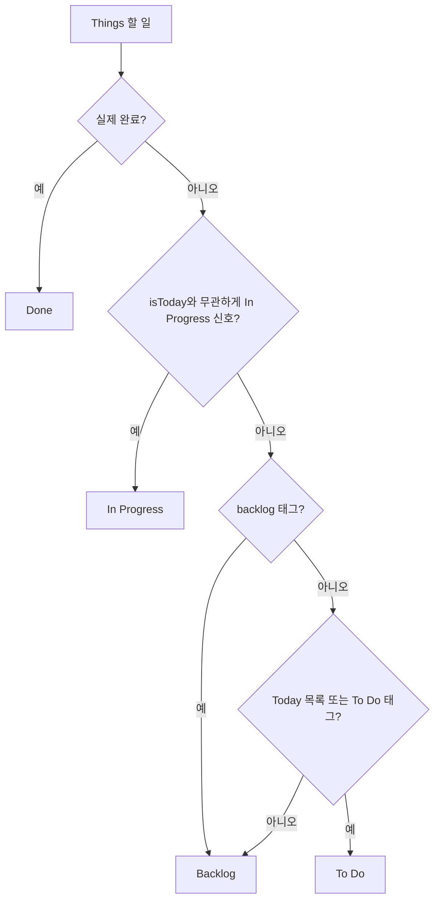
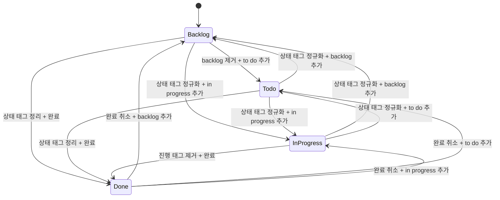
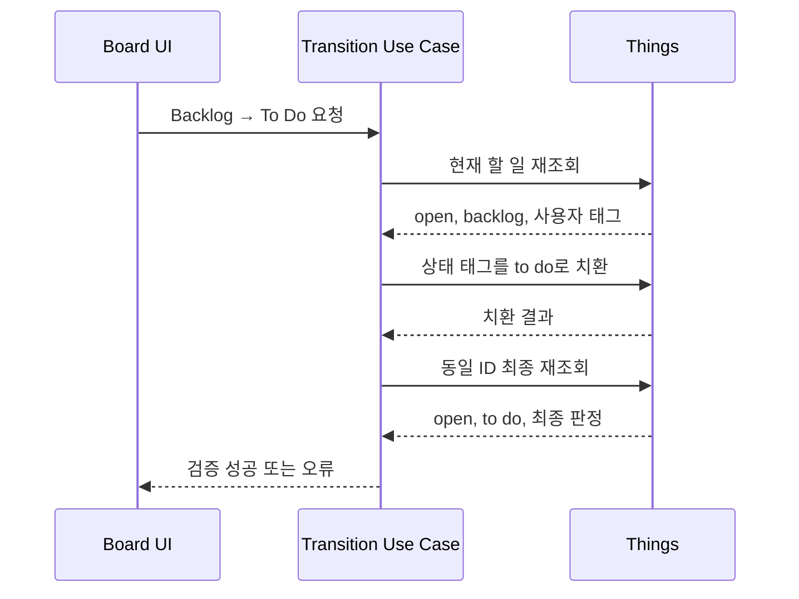

# Data Model: 4단계 할 일 상태

## Todo

| 필드               | 형식                                    | 규칙                                       |
| ------------------ | --------------------------------------- | ------------------------------------------ |
| `id`               | Things 공개 ID                          | 모든 쓰기와 재조회에서 동일 ID 사용        |
| `completionStatus` | `open`, `completed`, `canceled`         | Done 판정의 유일한 권위                    |
| `isToday`          | 불리언                                  | Things Today 목록의 실제 포함 여부         |
| `tags`             | 태그 목록                               | 상태 판정에 사용하며 관련 없는 태그는 보존 |
| `status`           | `backlog`, `todo`, `inProgress`, `done` | 완료·Today·태그 신호에서 파생              |
| `statusConflict`   | 불리언                                  | 열린 상태 신호가 둘 이상인지 표시          |
| `project`, `area`  | 선택적 소속                             | 상태 전이로 변경하지 않음                  |

## StatusSignal

| 구분        | 값                                          | 읽기                      | canonical 쓰기 |
| ----------- | ------------------------------------------- | ------------------------- | -------------- |
| Backlog     | `backlog`                                   | 명시적 Backlog            | Backlog 목표   |
| To Do       | Today 목록, `today`, `to do`, `status:todo` | To Do 판정                | `to do`        |
| In Progress | `in progress`, `status:in-progress`         | In Progress 판정          | `in progress`  |
| Done        | 실제 completed 상태                         | 모든 열린 신호보다 우선   | 실제 완료 상태 |
| user tag    | 그 외 모든 태그                             | 상태 판정에 사용하지 않음 | 그대로 보존    |

태그 이름은 기존 상태 태그 정규화 규칙으로 비교하며, 사용자 태그의 원래 이름은 수정하지 않는다.

## StatusResolution

| 필드         | 설명                                             |
| ------------ | ------------------------------------------------ |
| `status`     | 우선순위로 선택된 단일 보드 상태                 |
| `conflict`   | 서로 다른 열린 상태 태그 범주가 둘 이상인지 여부 |
| `statusTags` | 판정에 참여한 상태 태그 이름                     |
| `isToday`    | 판정에 참여한 Today 목록 신호                    |

## StatusTransition

| 필드                 | 설명                                             |
| -------------------- | ------------------------------------------------ |
| `todoId`             | 대상 Things 할 일 ID                             |
| `previousStatus`     | 요청 시 UI가 알고 있던 상태                      |
| `targetStatus`       | 사용자가 선택한 단일 목표 상태                   |
| `requestId`          | 중복 요청 추적용 식별자                          |
| `verifiedTodo`       | 최종 Things 재조회 결과                          |
| `normalizedConflict` | 명시적 전이로 상태 신호 충돌이 해소되었는지 여부 |

## Validation Rules

- completed는 모든 Today 및 상태 태그보다 우선하여 Done이다.
- open이고 In Progress 신호가 있으면 `isToday` 값이 참이든 거짓이든 In Progress다.
- `isToday`는 상태 선택에는 참여하지만 상태 태그 충돌 계산에는 참여하지 않는다.
- open이고 In Progress 신호가 없으며 `backlog`가 있으면 Backlog다.
- 앞 조건에 해당하지 않고 Today 목록, `today`, `to do`, `status:todo` 중 하나가 있으면 To Do다.
- 앞 조건에 해당하지 않는 open 항목은 Backlog다.
- canceled 또는 삭제된 항목은 보드의 활성 상태로 성공 처리하지 않는다.
- Backlog→To Do 후 open, canonical `to do` 정확히 하나, `backlog` 및 In Progress 신호 부재, 최종 `todo` 상태여야 한다.
- 상태 태그 외 태그, 제목, 날짜, 메모, Project와 Area는 변경하지 않는다.

## State Resolution

## State Transitions

## Backlog to To Do Sequence

