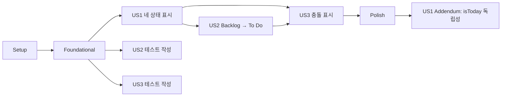

# Tasks: 4단계 할 일 상태

**Input**: Design documents from `/specs/004-add-backlog-status/`  
**Prerequisites**: plan.md, spec.md, research.md, data-model.md, contracts/transition-todo.md, quickstart.md

**Tests**: 프로젝트 헌법에 따라 도메인 규칙, Things 어댑터와 핵심 사용자 여정 테스트를 구현보다 먼저 작성한다.

**Organization**: 작업은 각 사용자 스토리가 독립적으로 구현·검증될 수 있도록 구성한다.

## Format: `[ID] [P?] [Story] Description`

- **[P]**: 선행 작업 완료 후 다른 파일에서 병렬 실행 가능
- **[Story]**: 명세의 사용자 스토리
- 모든 작업은 변경 또는 검증 대상의 정확한 경로를 포함한다.

## Phase 1: Setup (Shared Infrastructure)

**Purpose**: 현재 브랜치의 기준 상태와 구현 범위를 확인한다.

- [x] T001 `specs/004-add-backlog-status/quickstart.md`의 기준 명령으로 기존 TypeScript/Rust 테스트와 타입 검사를 실행하고 구현 전 실패가 없는지 확인한다

---

## Phase 2: Foundational (Blocking Prerequisites)

**Purpose**: 네 상태와 Today 신호를 백엔드·프런트엔드가 공유할 수 있게 준비한다.

**⚠️ CRITICAL**: 이 단계가 완료되기 전에는 사용자 스토리 구현을 시작하지 않는다.

- [x] T002 Rust `KanbanStatus::Backlog`, `Todo.is_today`, canonical/legacy 상태 태그 상수와 직렬화 필드를 `apps/things-kanban/src-tauri/src/domain/model/todo.rs`에 추가한다
- [x] T003 [P] TypeScript `KanbanStatus`에 `backlog`, `Todo`에 `isToday`를 `apps/things-kanban/src/shared/api/contracts.ts`에 추가한다
- [x] T004 [P] Rust todo 생성 fixture와 test repository가 `is_today` 및 네 상태를 지원하도록 `apps/things-kanban/src-tauri/src/domain/fixtures.rs`와 `apps/things-kanban/src-tauri/src/application/use_cases/test_repository.rs`를 확장한다
- [x] T005 [P] 프런트엔드 board fixture와 Storybook fixture에 Backlog 및 Today 조합을 `apps/things-kanban/src/shared/test/board-fixtures.ts`와 `apps/things-kanban/src/shared/test/storybook-board-fixtures.ts`에 추가한다

**Checkpoint**: 도메인, Tauri 응답과 React가 동일한 네 상태 및 Today 신호를 표현할 수 있다.

---

## Phase 3: User Story 1 - 네 가지 상태로 할 일 파악 (Priority: P1) 🎯 MVP

**Goal**: Project/Area 범위의 모든 할 일을 정의된 우선순위로 Backlog, To Do, In Progress, Done 중 정확히 한 칼럼에 표시한다.

**Independent Test**: 완료 여부, Today 포함 여부, `backlog`, `today`, `to do`, `in progress` 및 legacy 태그 조합 fixture를 조회하고 각 항목이 기대한 한 칼럼과 집계에만 표시되는지 검증한다.

### Tests for User Story 1

- [x] T006 [P] [US1] Done→In Progress→명시적 Backlog→To Do→기본 Backlog 판정 행렬과 충돌 신호 테스트를 `apps/things-kanban/src-tauri/src/domain/model/todo.rs`에 먼저 추가한다
- [x] T007 [P] [US1] AppleScript 행의 Today 포함 여부 파싱과 보드 조회 스크립트 계약 테스트를 `apps/things-kanban/src-tauri/src/infrastructure/things/applescript/repository.rs`에 먼저 추가한다
- [x] T008 [P] [US1] 네 상태 집계와 Project/Area 필터 결과 테스트를 `apps/things-kanban/src/entities/board/model/select-board.test.ts`에 먼저 추가한다
- [x] T009 [P] [US1] Backlog를 포함한 네 칼럼 렌더링, 제목, 개수와 빈 상태 테스트를 `apps/things-kanban/src/pages/board/board-page.test.tsx`에 먼저 추가한다

### Implementation for User Story 1

- [x] T010 [US1] 상태 태그 범주화, Today 신호와 우선순위 기반 단일 상태 판정을 `apps/things-kanban/src-tauri/src/domain/model/todo.rs`에 구현한다
- [x] T011 [US1] Things Today 목록 ID를 같은 읽기 실행에서 수집하고 `is_today` 필드로 파싱하도록 `apps/things-kanban/src-tauri/src/infrastructure/things/applescript/repository.rs`를 확장한다
- [x] T012 [P] [US1] Backlog를 포함한 네 상태 초기 집계와 타입 안전한 상태 순서를 `apps/things-kanban/src/entities/board/model/select-board.ts`에 구현한다
- [x] T013 [US1] Backlog 첫 칼럼, 네 상태 레이블·집계·드롭 대상과 반응형 네 칼럼 레이아웃을 `apps/things-kanban/src/pages/board/board-page.tsx`와 `apps/things-kanban/src/app/styles/globals.css`에 구현한다

**Checkpoint**: 쓰기 기능 없이도 Things의 권위 상태가 네 칼럼에 정확히 표시되고 기존 필터가 모두 적용된다.

---

## Phase 4: User Story 2 - Backlog를 To Do로 계획 (Priority: P2)

**Goal**: 사용자가 Backlog 카드를 To Do로 옮기면 `backlog`가 제거되고 canonical `to do`가 하나 추가되며 다른 데이터는 보존된다.

**Independent Test**: `backlog`와 사용자 태그 및 PARA 소속이 있는 열린 fixture를 Backlog→To Do로 전환하고 호출 순서, 최종 태그, 상태 판정과 보존 필드를 검증한다.

### Tests for User Story 2

- [x] T014 [P] [US2] 네 목표 상태별 canonical 태그 치환과 사용자 태그 보존 계약 테스트를 `apps/things-kanban/src-tauri/src/infrastructure/things/applescript/repository.rs`에 먼저 추가한다
- [x] T015 [P] [US2] Backlog→To Do 호출 순서, 멱등성, canonical `to do` 1개와 최종 검증 테스트를 `apps/things-kanban/src-tauri/src/application/use_cases/transition_todo.rs`에 먼저 추가한다
- [x] T016 [P] [US2] Backlog의 포인터/키보드 전이가 동일 요청을 보내고 낙관적 상태를 갱신하는 테스트를 `apps/things-kanban/src/features/move-todo/model/use-transition-todo.test.tsx`와 `apps/things-kanban/src/features/move-todo/ui/move-todo-menu.test.tsx`에 먼저 추가한다

### Implementation for User Story 2

- [x] T017 [US2] 상태 태그만 제거하고 목표별 `backlog`, `to do`, `in progress` canonical 태그를 하나 추가하도록 `apps/things-kanban/src-tauri/src/infrastructure/things/applescript/repository.rs`의 치환 로직을 확장한다
- [x] T018 [US2] Backlog→To Do의 사전 상태 확인과 open·canonical 태그·최종 상태 검증을 `apps/things-kanban/src-tauri/src/application/use_cases/transition_todo.rs`에 구현한다
- [x] T019 [US2] Backlog를 포함한 네 키보드 상태 선택지와 레이블을 `apps/things-kanban/src/features/move-todo/ui/move-todo-menu.tsx`에 구현하고 `apps/things-kanban/src/features/move-todo/model/use-transition-todo.ts`의 낙관적 갱신을 네 상태로 확장한다

**Checkpoint**: Backlog→To Do가 포인터와 키보드에서 동일하게 작동하고 새로고침 후에도 To Do로 유지된다.

---

## Phase 5: User Story 3 - 상태 충돌과 실패에서도 신뢰 유지 (Priority: P3)

**Goal**: 충돌하는 상태 신호와 자동화 실패 또는 외부 변경에서도 우선순위 상태를 표시하고 잘못된 성공 상태를 남기지 않는다.

**Independent Test**: 충돌 fixture와 각 단계 실패 repository를 사용해 단일 칼럼·충돌 표시, 오류 반환, snapshot 롤백 및 권위 재조회를 확인한다.

### Tests for User Story 3

- [x] T020 [P] [US3] 충돌 상태 태그, canceled 항목, 외부 상태 변경과 치환·완료·최종 조회 단계별 실패 테스트를 `apps/things-kanban/src-tauri/src/application/use_cases/transition_todo.rs`에 먼저 추가한다
- [x] T021 [P] [US3] mutation 실패 시 모든 board query snapshot 복구와 authoritative invalidation 테스트를 `apps/things-kanban/src/features/move-todo/model/use-transition-todo.test.tsx`에 먼저 추가한다
- [x] T022 [P] [US3] 충돌 표시와 진행·성공·실패 안내가 색상 없이 전달되는 테스트를 `apps/things-kanban/src/entities/todo/ui/todo-card.tsx`와 `apps/things-kanban/src/pages/board/board-page.test.tsx`에 먼저 추가한다

### Implementation for User Story 3

- [x] T023 [US3] 요청 전 상태 불일치, canceled 항목, 목표 canonical 태그 불일치와 최종 판정 불일치를 검증 오류로 처리하도록 `apps/things-kanban/src-tauri/src/application/use_cases/transition_todo.rs`를 강화한다
- [x] T024 [US3] 충돌 신호를 접근 가능한 카드 텍스트로 표시하고 상태 태그를 일반 사용자 태그에서 분리하도록 `apps/things-kanban/src/entities/todo/ui/todo-card.tsx`를 갱신한다
- [x] T025 [US3] 실패 시 snapshot 복구 후 전체 board query를 재검증하고 진행·성공·실패를 live region으로 안내하도록 `apps/things-kanban/src/features/move-todo/model/use-transition-todo.ts`, `apps/things-kanban/src/features/move-todo/ui/status-announcer.tsx`와 `apps/things-kanban/src/pages/board/board-page.tsx`를 검증·보강한다

**Checkpoint**: 모든 사용자 스토리가 실제 Things 상태로 수렴하며 권한·쓰기·외부 변경 실패를 성공으로 오인하지 않는다.

---

## Phase 6: Polish & Cross-Cutting Concerns

**Purpose**: 네 상태 전반의 회귀, 문서와 배포 품질을 검증한다.

- [x] T026 [P] 네 상태 fixture와 사용자 여정을 반영하도록 `apps/things-kanban/src/pages/board/board-page.stories.tsx`와 `apps/things-kanban/tests/e2e/board.spec.ts`를 갱신한다
- [x] T027 `specs/004-add-backlog-status/quickstart.md`의 자동 검증, 실제 Things smoke test, 태그·PARA 보존, 키보드 동등성 및 오류 복구 절차를 모두 실행한다
- [x] T028 AppleScript/URL scheme 이외의 Things 쓰기와 민감한 할 일 내용 로그가 추가되지 않았는지 `apps/things-kanban/src-tauri/src/infrastructure/`와 `apps/things-kanban/src-tauri/src/application/`을 검토하고 `git diff --check`를 실행한다

---

## Phase 7: User Story 1 Addendum - In Progress의 Today 독립성 (Priority: P1)

**Goal**: 열린 할 일에 `in progress` 태그가 있으면 `isToday` 값이 참이든 거짓이든 항상 In Progress로 판정된다는 추가 명세를 회귀 테스트로 고정한다.

**Independent Test**: 동일한 열린 할 일 fixture에 `in progress` 태그를 유지한 채 `is_today=true`와 `is_today=false`를 각각 설정하고 두 결과 모두 `KanbanStatus::InProgress`인지 확인한다.

### Tests for User Story 1 Addendum

- [x] T029 [US1] `in progress` 태그가 있는 열린 할 일을 `is_today=true`와 `is_today=false`로 각각 판정해 모두 In Progress임을 검증하는 회귀 테스트를 `apps/things-kanban/src-tauri/src/domain/model/todo.rs`에 추가한다

**Checkpoint**: 추가 명세가 두 Today 상태 모두에서 독립적으로 검증되며 기존 우선순위 테스트도 통과한다.

---

## Dependencies & Execution Order

### Phase Dependencies

- **Setup (Phase 1)**: 즉시 시작할 수 있다.
- **Foundational (Phase 2)**: Setup 이후 진행하며 모든 사용자 스토리를 차단한다.
- **US1 (Phase 3)**: Foundational 이후 진행하는 MVP다.
- **US2 (Phase 4)**: Foundational 이후 테스트 작성은 가능하지만 최종 상태 판정 검증에는 US1 도메인 판정이 필요하다.
- **US3 (Phase 5)**: Foundational 이후 오류 테스트 작성은 가능하지만 전체 충돌·복구 검증에는 US1과 US2가 필요하다.
- **Polish (Phase 6)**: 배포할 사용자 스토리가 모두 완료된 뒤 진행한다.
- **US1 Addendum (Phase 7)**: 기존 구현과 Polish 완료 후 진행하며 T029만 독립 실행할 수 있다.

### User Story Dependency Graph



### Within Each User Story

- 테스트 작업을 먼저 완료하고 예상대로 실패하는지 확인한다.
- 도메인 판정과 어댑터 계약을 UI 연결보다 먼저 구현한다.
- 백엔드 최종 검증이 통과한 뒤 낙관적 UI 성공 응답을 적용한다.
- 각 Checkpoint에서 해당 스토리의 Independent Test를 단독 실행한다.

### Parallel Opportunities

- T003, T004, T005는 T002와 병렬로 준비할 수 있다.
- US1 테스트 T006–T009는 서로 다른 테스트 경계에서 병렬 실행할 수 있다.
- T012는 T010 완료 후 T011과 병렬 실행할 수 있다.
- US2 테스트 T014–T016은 병렬 실행할 수 있다.
- US3 테스트 T020–T022는 병렬 실행할 수 있다.
- T026은 핵심 구현 완료 후 백엔드 최종 검토와 병렬 진행할 수 있다.
- T029는 기존 구현 파일 하나만 검증하므로 다른 문서·프런트엔드 후속 작업과 병렬 진행할 수 있다.

## Parallel Example: User Story 1

```text
Task T006: Rust 도메인 상태 판정 행렬 테스트
Task T007: AppleScript Today 읽기 계약 테스트
Task T008: board 집계와 필터 테스트
Task T009: 네 칼럼 React 렌더링 테스트
Task T029: isToday true/false In Progress 우선순위 회귀 테스트
```

## Parallel Example: User Story 2

```text
Task T014: AppleScript 상태 태그 치환 계약 테스트
Task T015: Rust Backlog→To Do 유스케이스 테스트
Task T016: React 포인터/키보드 전이 테스트
```

## Parallel Example: User Story 3

```text
Task T020: Rust 단계별 실패와 외부 변경 테스트
Task T021: TanStack Query snapshot 롤백 테스트
Task T022: 충돌 및 live region 접근성 테스트
```

## Implementation Strategy

### MVP First

1. T001로 기준 상태를 확인한다.
2. T002–T005로 네 상태 공유 기반을 만든다.
3. T006–T013으로 US1을 테스트 우선 구현한다.
4. 중단하고 US1 Independent Test를 실행해 네 칼럼 조회 MVP를 검증한다.

### Incremental Delivery

1. Setup + Foundational → 네 상태 계약 준비
2. US1 → 네 상태 읽기 및 표시 MVP
3. US2 → 안전한 Backlog→To Do 쓰기
4. US3 → 충돌·실패 복구 완성
5. Polish → 실제 Things와 전체 품질 게이트 검증
6. US1 Addendum → `isToday` 양쪽 경우의 In Progress 회귀 테스트

### Recommended Commit Units

1. Foundational shared status contracts and fixtures
2. US1 backend status resolution and Today read
3. US1 four-column frontend
4. US2 Backlog→To Do adapter and use case
5. US2 accessible move UI
6. US3 conflict and recovery handling
7. Cross-cutting regression tests and documentation
8. In Progress precedence regression test

## Notes

- `[P]` 작업은 선행 조건이 완료된 뒤 다른 파일에서 병렬 진행할 수 있다.
- `[US1]`, `[US2]`, `[US3]`는 명세의 사용자 스토리와 추적된다.
- 테스트는 구현 전에 작성하고 실패를 확인한다.
- 상태 전이 쓰기는 AppleScript 또는 Things URL scheme만 사용하며 SQLite 직접 쓰기는 금지한다.
- 각 작업 또는 논리적 작업 단위 후 커밋한다.
