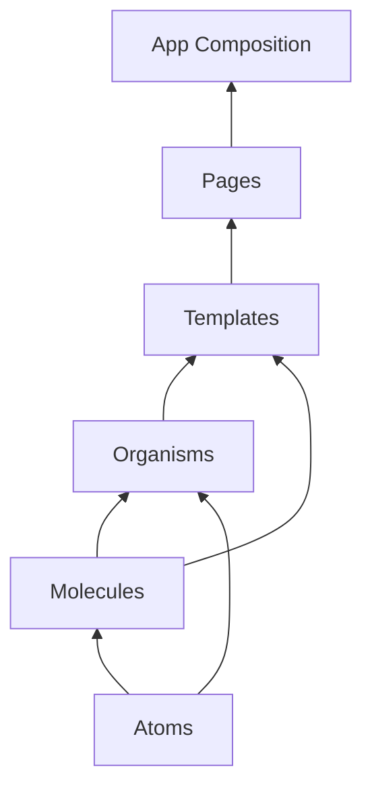
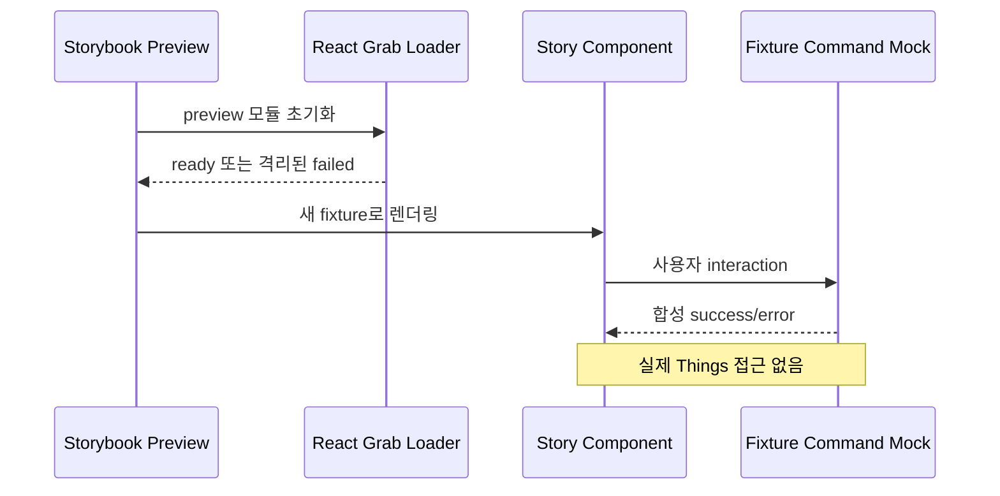

# Data Model: Atomic Storybook 컴포넌트 카탈로그

## AtomicLayer

| 값          | 책임                                                  | 허용 의존                   |
| ----------- | ----------------------------------------------------- | --------------------------- |
| `atoms`     | 더 작은 UI로 분해하지 않는 범용 시각·접근성 primitive | 공통 타입과 스타일          |
| `molecules` | Atom을 조합한 단일 목적의 작은 상호작용               | Atoms                       |
| `organisms` | 화면의 독립된 주요 영역 또는 도메인 표현              | Molecules, Atoms            |
| `templates` | 데이터와 callback을 주입받는 화면 레이아웃            | Organisms, Molecules, Atoms |
| `pages`     | 조회·mutation·navigation을 Template에 연결            | Templates 및 FSD model/api  |

하위 계층은 표에서 아래에 있는 상위 조합 계층을 import할 수 없다.

## ComponentCatalogEntry

| 필드           | 설명                                                                 |
| -------------- | -------------------------------------------------------------------- |
| `title`        | `Atoms/Name` 형태의 유일한 Storybook 탐색 경로                       |
| `component`    | 제품 앱과 Story가 공유하는 React 컴포넌트                            |
| `layer`        | 정확히 하나의 AtomicLayer                                            |
| `states`       | normal, loading, empty, error, pending, conflict 중 적용 가능한 상태 |
| `controls`     | 검토자가 변경할 수 있는 공개 props                                   |
| `interactions` | keyboard, pointer, form 또는 drag 대체 흐름                          |
| `ownerSlice`   | shared, entity, feature 또는 page FSD 소유자                         |

## StoryFixture

| 필드              | 규칙                                      |
| ----------------- | ----------------------------------------- |
| `id`              | 실제 Things ID가 아닌 합성 식별자         |
| `data`            | 합성 제목, 태그, Project/Area 및 상태     |
| `commandBehavior` | success, error 또는 pending mock          |
| `initialScope`    | all, project 또는 area의 재현 가능한 선택 |
| `reset`           | Story 시작마다 새 상태를 반환             |

StoryFixture는 실제 Things, Tauri runtime 또는 macOS 자동화 권한을 참조하지 않는다.

## FeedbackRuntime

| 필드             | 설명                                          |
| ---------------- | --------------------------------------------- |
| `environment`    | Storybook preview 여부                        |
| `initialization` | idle, loading, ready, failed                  |
| `promise`        | 동시 호출을 합치는 전역 초기화 promise        |
| `failure`        | Story 렌더링을 차단하지 않는 비민감 오류 상태 |

## Validation Rules

- 각 ComponentCatalogEntry는 정확히 하나의 AtomicLayer를 가진다.
- 다섯 계층에는 각각 최소 하나의 entry가 있다.
- Story title의 첫 segment는 entry의 layer와 일치한다.
- Template entry의 component는 query 또는 Tauri command를 직접 호출하지 않는다.
- Page entry의 command는 Story fixture mock으로 대체된다.
- React Grab 초기화 promise는 preview 문서 전역에서 최대 하나다.
- 초기화 failed 상태에서도 Story component는 렌더링되고 상호작용할 수 있다.
- 제품 production 진입점에서는 Storybook FeedbackRuntime을 만들지 않는다.

## Component Composition

## Story Runtime

