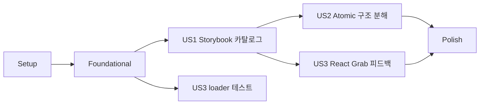

# Tasks: Atomic Storybook 컴포넌트 카탈로그

**Input**: Design documents from `/specs/005-storybook-atomic-components/`  
**Prerequisites**: plan.md, spec.md, research.md, data-model.md, contracts/component-catalog.md, contracts/storybook-preview.md, quickstart.md

**Tests**: 프로젝트 헌법에 따라 Storybook 렌더링, Atomic 의존 방향, Things 격리, 접근성 및 React Grab 멱등 초기화 테스트를 구현보다 먼저 작성한다.

**Organization**: 작업은 각 사용자 스토리가 독립적으로 구현·검증될 수 있도록 구성한다.

## Format: `[ID] [P?] [Story] Description`

- **[P]**: 선행 작업 완료 후 다른 파일에서 병렬 실행 가능
- **[Story]**: 명세의 사용자 스토리
- 모든 작업은 변경 또는 검증 대상의 정확한 경로를 포함한다.

## Phase 1: Setup (Shared Infrastructure)

**Purpose**: 현재 Storybook과 제품 앱의 기준 상태 및 대상 컴포넌트를 확인한다.

- [x] T001 `specs/005-storybook-atomic-components/quickstart.md`의 TypeScript, frontend, Storybook build 및 E2E 기준 명령을 실행해 구현 전 기준 상태를 확인한다
- [x] T002 [P] 사용자 노출 React 컴포넌트와 계획된 Atomic 계층 매핑을 `specs/005-storybook-atomic-components/contracts/component-catalog.md` 기준으로 점검하고 누락 대상을 기록한다

---

## Phase 2: Foundational (Blocking Prerequisites)

**Purpose**: 모든 Story가 실제 Things 없이 재현 가능하게 렌더링되는 공통 기반을 만든다.

**⚠️ CRITICAL**: 이 단계가 완료되기 전에는 사용자 스토리 구현을 시작하지 않는다.

- [x] T003 합성 board/todo fixture factory에 normal, empty, loading, error, pending, conflict 상태를 `apps/things-kanban/src/shared/test/storybook-board-fixtures.ts`에 추가한다
- [x] T004 [P] Story마다 독립 QueryClient와 Tauri command mock을 생성하고 예상하지 않은 실제 command 호출을 실패시키는 decorator를 `apps/things-kanban/src/shared/test/storybook-decorators.tsx`에 구현한다
- [x] T005 [P] Storybook의 Atomic 계층 정렬, 전역 스타일, 접근성 오류 기준과 Story 격리 decorator를 `apps/things-kanban/.storybook/preview.tsx`에 구성한다
- [x] T006 [P] Story 파일 탐색 및 테스트 addon 설정이 colocated CSF Story와 interaction 검증을 포함하도록 `apps/things-kanban/.storybook/main.ts`를 검증·보강한다

**Checkpoint**: Story가 실제 Things/Tauri 없이 독립 fixture와 provider로 렌더링될 수 있다.

---

## Phase 3: User Story 1 - 컴포넌트를 계층별로 탐색 (Priority: P1) 🎯 MVP

**Goal**: Atoms, Molecules, Organisms, Templates, Pages 다섯 계층에서 실제 제품 컴포넌트와 대표 상태를 탐색한다.

**Independent Test**: Storybook을 열어 다섯 계층 각각에 최소 한 Story가 있고, normal·disabled/pending·empty·conflict·error 상태가 실제 앱 전체 실행 없이 렌더링되는지 확인한다.

### Tests for User Story 1

- [x] T007 [P] [US1] 다섯 Atomic title prefix, 대상 컴포넌트의 단일 주 계층 및 필수 대표 상태를 검증하는 카탈로그 계약 테스트를 `apps/things-kanban/src/shared/test/component-catalog.test.ts`에 먼저 추가한다
- [x] T008 [P] [US1] BoardTemplate의 populated, empty, pending 및 error presentation 렌더링 테스트를 `apps/things-kanban/src/pages/board/ui/templates/board-template.test.tsx`에 먼저 추가한다
- [x] T009 [P] [US1] Story fixture 사용 중 실제 Tauri command가 호출되지 않는 Page Story 격리 테스트를 `apps/things-kanban/src/pages/board/board-page.stories.test.tsx`에 먼저 추가한다

### Implementation for User Story 1

- [x] T010 [P] [US1] disabled와 count 상태를 표시하는 범용 Atom 및 Story를 `apps/things-kanban/src/shared/ui/atoms/icon-button.tsx`, `apps/things-kanban/src/shared/ui/atoms/count-badge.tsx`와 colocated story 파일에 구현한다
- [x] T011 [P] [US1] RefreshButton, OpenInThingsButton, MoveTodoMenu의 normal, disabled/pending 및 keyboard interaction Story를 `apps/things-kanban/src/features/refresh-board/ui/refresh-button.stories.tsx`, `apps/things-kanban/src/features/open-in-things/open-in-things-button.stories.tsx`, `apps/things-kanban/src/features/move-todo/ui/move-todo-menu.stories.tsx`에 추가한다
- [x] T012 [P] [US1] TodoCard, BoardColumn, BoardFilters, BoardSidebar, BoardSkeleton의 populated, empty, pending 및 conflict Story를 각 `apps/things-kanban/src/entities/` 및 `apps/things-kanban/src/features/` UI 파일 옆에 추가한다
- [x] T013 [US1] query/mutation 없이 props로 header, filters, sidebar, 네 칼럼과 status bar를 조합하는 `apps/things-kanban/src/pages/board/ui/templates/board-template.tsx`를 추출하고 제품 Page에서 재사용한다
- [x] T014 [US1] BoardTemplate의 populated, empty, pending, error Story를 `apps/things-kanban/src/pages/board/ui/templates/board-template.stories.tsx`에 추가한다
- [x] T015 [US1] BoardPage의 populated, query error 및 keyboard transition Story를 독립 decorator와 fixture로 `apps/things-kanban/src/pages/board/board-page.stories.tsx`에 갱신한다

**Checkpoint**: 다섯 Atomic 계층과 대표 상태를 Storybook에서 독립적으로 탐색할 수 있다.

---

## Phase 4: User Story 2 - Atomic Design 구조로 책임 분리 (Priority: P2)

**Goal**: 실제 제품 컴포넌트가 FSD 소유권을 유지하면서 Atoms→Molecules→Organisms→Templates→Pages 방향으로 조합된다.

**Independent Test**: Board Page import graph를 검사해 하위 Atomic 계층이 상위 계층을 import하지 않고, BoardTemplate이 query/Tauri에 의존하지 않으며 기존 제품 UI 및 접근성 테스트가 통과하는지 확인한다.

### Tests for User Story 2

- [x] T016 [P] [US2] 금지된 상위 Atomic import와 BoardTemplate의 query/Tauri import를 탐지하는 구조 계약 테스트를 `apps/things-kanban/src/shared/test/atomic-boundaries.test.ts`에 먼저 추가한다
- [x] T017 [P] [US2] 구조 분해 전후 BoardPage의 accessible name, focus 순서, 네 칼럼과 action 동등성을 검증하도록 `apps/things-kanban/src/pages/board/board-page.test.tsx`를 먼저 보강한다
- [x] T018 [P] [US2] TodoCard가 feature 구현을 직접 import하지 않고 주입된 action으로 동작하는 테스트를 `apps/things-kanban/src/entities/todo/ui/molecules/todo-card.test.tsx`에 먼저 추가한다

### Implementation for User Story 2

- [x] T019 [P] [US2] Open/refresh action의 공통 시각 primitive를 `apps/things-kanban/src/shared/ui/atoms/`에서 재사용하도록 feature 버튼 구현을 리팩터링한다
- [x] T020 [US2] TodoCard를 action slot/callback 기반 Molecule로 `apps/things-kanban/src/entities/todo/ui/molecules/todo-card.tsx`에 이동해 entity→feature 역방향 import를 제거하고 import 사용처를 갱신한다
- [x] T021 [P] [US2] BoardColumn과 BoardSkeleton을 organism 경계로 `apps/things-kanban/src/entities/board/ui/organisms/`에 정리하고 Story 및 import 사용처를 갱신한다
- [x] T022 [P] [US2] BoardFilters와 BoardSidebar의 feature 소유권을 유지하면서 하위 Atom/Molecule 조합을 명확히 하고 각 Story title을 Organisms 계층으로 `apps/things-kanban/src/features/filter-board/ui/`와 `apps/things-kanban/src/features/select-board-scope/ui/`에서 정리한다
- [x] T023 [US2] BoardPage가 orchestration만 수행하고 `apps/things-kanban/src/pages/board/ui/templates/board-template.tsx`에 모든 렌더링 props와 callbacks를 전달하도록 `apps/things-kanban/src/pages/board/board-page.tsx`를 정리한다
- [x] T024 [US2] 이동된 컴포넌트의 public export와 alias import를 `apps/things-kanban/src/entities/todo/model.ts`, `apps/things-kanban/src/entities/board/model.ts` 및 관련 index 파일에 정리한다

**Checkpoint**: Atomic 의존 방향과 FSD 경계가 모두 통과하며 제품 UI 회귀가 없다.

---

## Phase 5: User Story 3 - 렌더링된 요소에 빠르게 피드백 (Priority: P3)

**Goal**: 모든 Storybook preview에서 React Grab을 한 번만 안전하게 초기화하고 실패해도 Story를 계속 사용한다.

**Independent Test**: 각 계층 대표 Story에서 요소 문맥을 확인하고 Story를 20회 전환해 초기화가 한 번뿐인지, import 실패 상태에서도 canvas와 keyboard interaction이 유지되는지 검증한다.

### Tests for User Story 3

- [x] T025 [P] [US3] 동시 호출·StrictMode·20회 Story 전환에서 React Grab loader promise가 하나인지 검증하는 테스트를 `apps/things-kanban/.storybook/react-grab-loader.test.ts`에 먼저 추가한다
- [x] T026 [P] [US3] React Grab import 실패가 Story 렌더링과 interaction을 중단하지 않는 preview 테스트를 `apps/things-kanban/.storybook/preview.test.tsx`에 먼저 추가한다
- [x] T027 [P] [US3] production 앱 entry가 Storybook feedback loader를 import하지 않는 경계 테스트를 `apps/things-kanban/src/shared/test/production-boundaries.test.ts`에 먼저 추가한다

### Implementation for User Story 3

- [x] T028 [US3] `globalThis`에 단일 promise를 저장하고 React Grab 동적 import 실패를 격리하는 loader를 `apps/things-kanban/.storybook/react-grab-loader.ts`에 구현한다
- [x] T029 [US3] 전역 preview에서 loader를 한 번 호출하고 Story decorator 렌더와 분리하도록 `apps/things-kanban/.storybook/preview.tsx`에 연결한다
- [x] T030 [US3] 제품 개발 entry의 React Grab 초기화와 Storybook preview 초기화 경계를 명확히 하고 production 비활성 조건을 `apps/things-kanban/src/main.tsx`에서 검증·정리한다

**Checkpoint**: React Grab 피드백이 모든 Story에 제공되고 중복·실패가 Storybook이나 제품 앱에 영향을 주지 않는다.

---

## Phase 6: Polish & Cross-Cutting Concerns

**Purpose**: 카탈로그 완성도, Things 안전, 접근성 및 제품 회귀를 최종 검증한다.

- [x] T031 [P] Storybook 탐색 이름, controls와 상태 설명을 모든 `apps/things-kanban/src/**/*.stories.tsx` 파일에서 일관되게 정리한다
- [x] T032 [P] 다섯 계층의 keyboard interaction, drag 대체 select와 axe 오류 0건을 `apps/things-kanban/tests/e2e/storybook.spec.ts`에서 검증한다
- [x] T033 실제 Things 제목·ID·태그가 fixture에 없고 Storybook 실행 중 실제 Tauri command가 0회인지 `apps/things-kanban/src/shared/test/`와 `apps/things-kanban/.storybook/`을 검토한다
- [x] T034 `specs/005-storybook-atomic-components/quickstart.md`의 전체 자동 검증, 20회 React Grab 전환, 제품 build 및 `git diff --check`를 실행한다

---

## Dependencies & Execution Order

### Phase Dependencies

- **Setup (Phase 1)**: 즉시 시작할 수 있다.
- **Foundational (Phase 2)**: Setup 이후 진행하며 모든 사용자 스토리를 차단한다.
- **US1 (Phase 3)**: Foundational 이후 진행하는 Storybook 카탈로그 MVP다.
- **US2 (Phase 4)**: US1의 실제 컴포넌트와 BoardTemplate Story를 유지하면서 물리적 경계와 import 방향을 정리한다.
- **US3 (Phase 5)**: Foundational 이후 loader 테스트를 시작할 수 있으나 모든 계층에서 최종 검증하려면 US1이 필요하다.
- **Polish (Phase 6)**: US1–US3 완료 후 진행한다.

### User Story Dependency Graph



### Within Each User Story

- 테스트를 먼저 작성하고 구현 전 실패를 확인한다.
- fixture/provider 기반 이후 Story를 추가한다.
- presentational 경계 이후 Page orchestration을 연결한다.
- loader 단위 테스트 이후 preview 전역에 연결한다.
- 각 Checkpoint에서 Independent Test를 단독 실행한다.

### Parallel Opportunities

- T002는 T001 기준 검증과 병렬 진행할 수 있다.
- T004–T006은 T003 fixture 형태가 확정된 뒤 서로 다른 설정 파일에서 병렬 진행할 수 있다.
- US1 테스트 T007–T009는 병렬 실행할 수 있다.
- Story 작성 T010–T012는 서로 다른 UI slice에서 병렬 진행할 수 있다.
- US2 테스트 T016–T018은 병렬 실행할 수 있다.
- T019, T021, T022는 서로 다른 UI 경계에서 병렬 진행할 수 있다.
- US3 테스트 T025–T027은 병렬 실행할 수 있다.
- T031과 T032는 핵심 구현 완료 후 병렬 진행할 수 있다.

## Parallel Example: User Story 1

```text
Task T007: 다섯 계층 카탈로그 계약 테스트
Task T008: BoardTemplate 대표 상태 테스트
Task T009: Page Story Things 격리 테스트
Task T010: Atoms와 Stories
Task T011: Molecules Stories
Task T012: Organisms Stories
```

## Parallel Example: User Story 2

```text
Task T016: Atomic import 경계 테스트
Task T017: BoardPage UI·접근성 회귀 테스트
Task T018: TodoCard action 주입 테스트
```

## Parallel Example: User Story 3

```text
Task T025: React Grab 멱등 loader 테스트
Task T026: 초기화 실패 격리 테스트
Task T027: production import 경계 테스트
```

## Implementation Strategy

### MVP First

1. T001–T002로 기준과 대상 목록을 확인한다.
2. T003–T006으로 Story 격리 기반을 만든다.
3. T007–T015로 다섯 Atomic 계층 카탈로그를 테스트 우선 구현한다.
4. 중단하고 US1 Independent Test와 Storybook 정적 build를 검증한다.

### Incremental Delivery

1. Setup + Foundational → 재현 가능한 Story 기반
2. US1 → 다섯 계층 Storybook 카탈로그 MVP
3. US2 → 실제 Atomic/FSD 컴포넌트 경계 정리
4. US3 → React Grab 전역 피드백
5. Polish → Things 격리·접근성·제품 회귀 완성

### Recommended Commit Units

1. Storybook fixtures and isolated providers
2. Atomic catalog stories and BoardTemplate
3. Shared atoms and TodoCard dependency cleanup
4. Board organisms and Page orchestration
5. React Grab idempotent Storybook loader
6. Storybook accessibility and production regression coverage

## Notes

- `[P]` 작업은 선행 조건 완료 후 다른 파일에서 병렬 진행할 수 있다.
- `[US1]`, `[US2]`, `[US3]`는 명세 사용자 스토리와 추적된다.
- 테스트는 구현 전에 작성하고 실패를 확인한다.
- 모든 Story는 합성 fixture와 mock command만 사용하며 실제 Things에 접근하지 않는다.
- 각 작업 또는 논리적 작업 단위 후 커밋한다.
